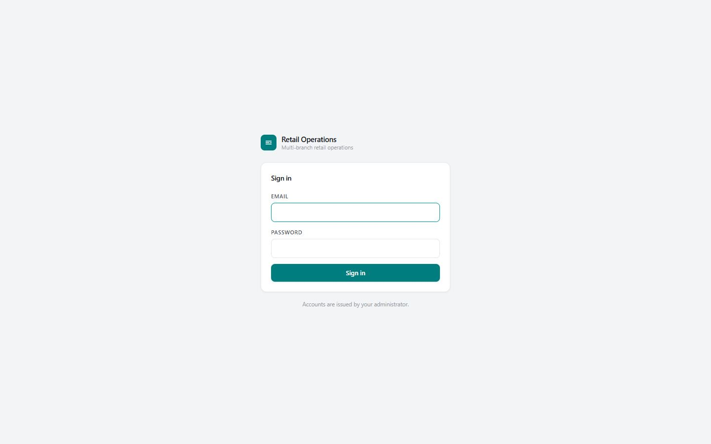
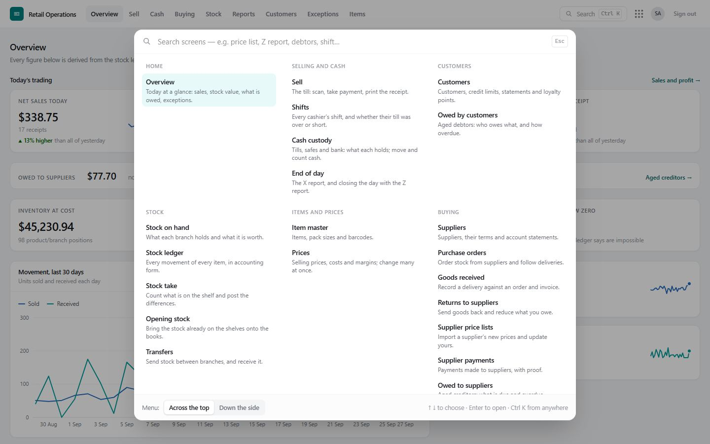
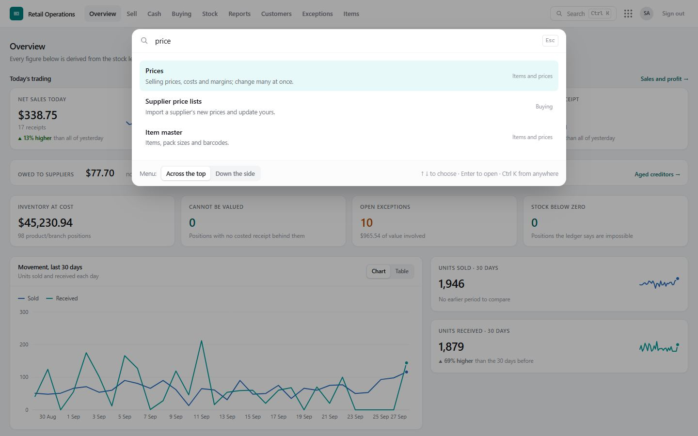
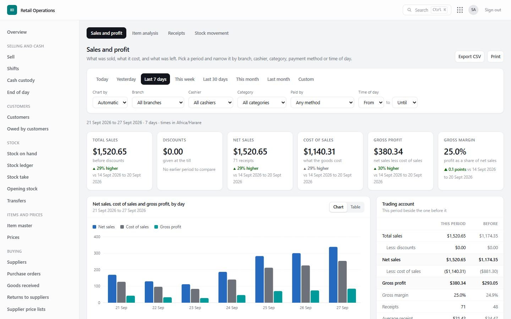
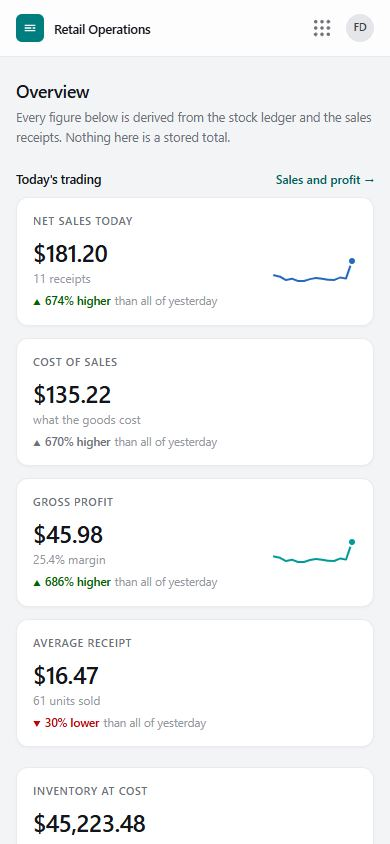

# 2. Getting started

## Signing in

Open the system in any modern browser (Chrome, Edge, Firefox, Safari) on a till, laptop, tablet or phone, and sign in with your **email** and **password**.

- **First time:** your administrator gives you a temporary password. The system makes you choose your own before you can do anything else. It must be long enough and not easy to guess.
- **Forgotten password:** ask an administrator to **Reset password** on the Staff screen. You get a new temporary password and choose your own again. Nobody — not even an administrator — can see your password.
- **Too many wrong attempts:** after 8 wrong passwords the account is locked for 15 minutes. This protects you if someone tries to guess it.
- **Signed out after a while:** a session lasts 12 hours (one long shift). Sign in again.

## Finding your way

The system shows **only the screens your job needs**. A cashier sees *Sell* and *Cash*; a branch manager sees most things for their branch; an administrator sees everything. If you expect a screen and do not see it, your access does not include it — see [Roles and access](03-roles-and-access.md).

**The top bar** holds the main areas you work in — for example *Overview · Sell · Cash · Buying · Stock · Reports*. Screens that belong together have a row of tabs underneath (**Buying** has *Suppliers, Orders, Goods received, Returns, Price lists, Payments, Owed to suppliers*).

**All screens — the nine dots** (⋮⋮⋮ at the top right, or **Ctrl + K** from anywhere) opens a panel with every screen you may use, grouped by area, each with a line saying what it is for.

**Search.** Start typing in that panel — *price list*, *Z report*, *debtors*, *shift*, *who changed* — and the matching screens appear. **↑ ↓** to choose, **Enter** to open.

**Across the top or down the side.** At the bottom of the panel, choose **Menu: Across the top** or **Down the side**. *Down the side* keeps every screen, grouped by area, in a bar on the left — handy on a large screen or if you move around a lot. The choice is remembered on that computer.

| Area | Screens |
|---|---|
| **Home** | Overview |
| **Selling and cash** | Sell · Shifts · Cash custody · End of day |
| **Customers** | Customers · Owed by customers |
| **Stock** | Stock on hand · Stock ledger · Stock take · Opening stock · Transfers |
| **Items and prices** | Item master · Prices |
| **Buying** | Suppliers · Purchase orders · Goods received · Returns to suppliers · Supplier price lists · Supplier payments · Owed to suppliers |
| **Reports and controls** | Sales and profit · Sales receipts · Item analysis · Stock movement · Exceptions · Audit log |
| **Administration** | Staff and access · Branches · Settings · User guide |

**On a phone** the top bar folds away: the nine dots open the same panel, full screen, with search.

## Setting up a new business — the checklist

An administrator does this once, in this order. Each step links to its chapter.

| # | Step | Where | Notes |
|---|---|---|---|
| 1 | Business name, address, phone, tax number, receipt footer and paper width | **Settings** | Printed on every receipt. Also set the business **time zone** so "today" matches the shop's day. |
| 2 | Branches | **Branches** | One per shop or warehouse. The number of active branches follows your plan. |
| 3 | Staff accounts and roles | **Staff** | One account per person, never shared. See [Roles and access](03-roles-and-access.md). |
| 4 | Items, packs and barcodes | **Item master** | Or let cashiers add missing items at the till; a manager reviews them. |
| 5 | Selling prices | **Prices** | One by one, in bulk by rule, or from a supplier's list. |
| 6 | Opening stock at each branch | **Stock entry › Opening stock** | Paste straight from a spreadsheet: item, quantity, cost. |
| 7 | Tills and safes, and their opening cash | **Cash** | Each till is a cash point with its own balance. |
| 8 | Suppliers | **Buying › Suppliers** | Terms (cash or credit), credit days. |
| 9 | Customers on credit (if any) | **Customers** | Credit limits. |
| 10 | Choose the options | **Settings** | *Tills need an open shift to sell* · *Loyalty points* (rate and value). |

## Printing receipts

The Sell screen prints through the browser to any receipt printer the computer can print to — USB, network or Bluetooth. Set the paper width (58 mm or 80 mm) in **Settings**, then on the till computer:

1. Install the printer's driver and make it the **default printer**.
2. In the browser's print dialog, choose that printer, set **margins to None** and turn **headers and footers off** once; the browser remembers.
3. In Chrome you can skip the dialog entirely by starting it with `--kiosk-printing` (ask your IT person).

Every receipt can be printed again from **This session** on the Sell screen, or by anyone with sales access from **Reports › Sales**.

## Working on phones and tablets

Everything works on a phone or tablet. Managers typically use the **Overview**, **Exceptions**, **Stock on hand** and **Reports** on the move; receivers use **Goods received** on a tablet in the storeroom. The till works best on a computer with a barcode scanner (any USB scanner that "types" the code works, no setup needed).
