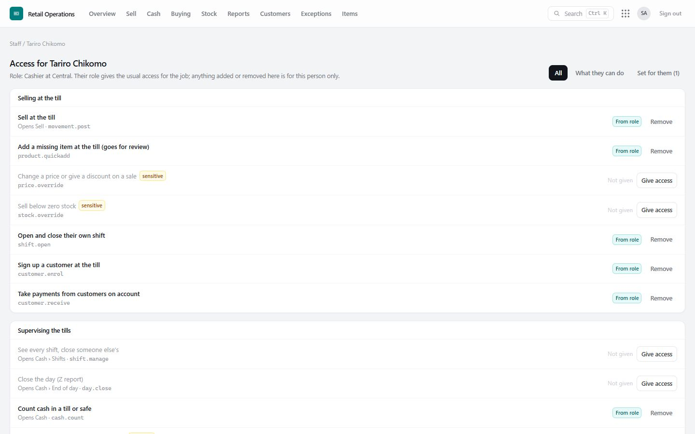

# 3. Roles and access

Access is built from **permissions** — single things a person may do, such as *Sell at the till* or *See sales, costs and profit*. A **role** is the usual bundle of permissions for a job. Every screen and every action checks the permission it needs, on the server, every time; hiding a button is only a courtesy.

## The roles

| Role | Typically sees | Can | Cannot |
|---|---|---|---|
| **Cashier** | Sell, Cash | Sell; open and close their own shift; count cash; sign up customers; take payments on account; add a missing item at the till (it goes for review) | See the item master, costs, profit, other people's shifts; change prices; sell below zero stock |
| **Shift Supervisor** | Sell, Cash, Customers, Stock on hand, Reports (sales), Exceptions, Buying (read only) | Everything a cashier can, plus close anyone's shift, move cash between tills and safe, close the day (Z report), see sales | Change prices, pay suppliers, adjust stock |
| **Goods Receiver** | Buying (receiving), Transfers, Stock on hand | Receive deliveries, send and receive transfers, look items up | See profit, pay suppliers |
| **Stock Controller** | Item master, Prices, Stock, Buying, Stock entry | Keep items and prices, order from suppliers, import supplier price lists, stock takes, opening stock; see cash positions | Count or move cash, pay suppliers |
| **Branch Manager** | Nearly everything, for their branch | Run the branch: sell, override prices, receive, count, order, close the day, manage customers and credit | Pay suppliers; manage staff; change settings |
| **Finance** | Overview, Buying, Customers, Reports, Cash (read) | Pay suppliers, manage customers and credit, read sales and profit | Sell, move stock |
| **Auditor** | Everything, read only | Read every screen, including the [audit log](09-reports-and-controls.md#the-audit-log); clear exceptions | Change anything else |
| **Administrator** | Everything | Everything, including staff, access, branches and settings | Change their **own** access |

**Branch scope.** A person can be tied to one branch or be group-wide. A branch-tied person sees and acts on their own branch only, and group-wide money (what the group owes suppliers, for instance) is hidden from them.

### Why a cashier does not see the item master

A cashier needs to *find* items while selling — by scanning, or by typing part of a name — and see the price. The Sell screen does exactly that, and it never shows costs. The item master is a management screen: every item in the group, all its packs and barcodes, where it is stocked. A cashier gains nothing from it at the till, and it shows more than their job needs. If a particular cashier does need it (a senior cashier who helps with stock questions, say), give it to that person alone — see below.

## Access for one person

Sometimes one person needs a little more than their role gives, or a little less. An administrator sets this on the person's **Access** page: **Staff → Access** next to their name.

Each permission shows:

- what it lets them do, in plain words, and **which screen it opens**;
- **sensitive** where it can move money or stock, or change access or settings;
- where it comes from: **From role**, **Added for them**, **Removed for them**, or **Not given**.

| To… | Do this |
|---|---|
| Give one person something their role does not include | **Give access**, add the reason, confirm. |
| Take away something their role gives | **Remove**, add the reason, confirm. |
| Undo either | **Back to role**. |

What happens next:

- It applies on the person's **next click** — no need for them to sign out.
- It applies to **that person only**; everyone else with the same role is unchanged.
- It is written to the [audit log](09-reports-and-controls.md#the-audit-log) with who changed it, when and why. Access *added* beyond a role also goes to the **exception queue** so a second person can check it is still needed.
- The staff list shows **+1 added** / **−1 removed** next to anyone with personal access, so it is never forgotten.

**Safeguards.** Nobody can change their own access (another administrator must). Nobody can give access they do not hold themselves. The database itself refuses a self-given permission.

### Good practice

- Prefer giving **one permission to one person** over giving them a bigger role.
- Always write the reason; it is what an auditor reads a year later.
- Review the **+ added** people every few months: access given for a reason tends to outlive the reason.
- Keep **sensitive** permissions (price changes at the till, selling below zero, stock takes, zeroing a branch, paying suppliers, staff and settings) to as few people as possible.

## All permissions

| Area | Permission | Lets a person… |
|---|---|---|
| Selling | Sell at the till | Sell, scan and search items at the till |
| | Add a missing item at the till | Add an item not yet in the master (goes for review) |
| | Change a price or give a discount *(sensitive)* | Sell away from the list price |
| | Sell below zero stock *(sensitive)* | Complete a sale the stock ledger says is not possible |
| | Open and close their own shift | Count the float in and cash out |
| | Sign up a customer at the till | Name and phone, no credit |
| | Take payments from customers on account | Receive money towards what a customer owes |
| Supervising | See every shift, close someone else's | Shifts screen |
| | Close the day (Z report) | End of day |
| | Count / move cash *(moving is sensitive)* / see cash positions | Cash screen |
| Items and prices | See the item master · Add and change items · Set selling prices *(sensitive)* | Item master, Prices, supplier price lists |
| Stock | See stock · Stock take *(sensitive)* · Opening stock *(sensitive)* · Zero a branch *(sensitive)* · Transfers | Stock screens |
| Buying | See suppliers and costs · Change suppliers · Order · Receive · Return · Pay suppliers *(sensitive)* | Buying |
| Customers | See customers · Add customers and set credit *(sensitive)* · Adjust loyalty points *(sensitive)* | Customers |
| Oversight | Overview · Sales, costs and profit · Exceptions (see / clear) · See the audit log | Overview, Reports, Exceptions › Exception queue, Exceptions › Audit log |
| Administration | See staff · Manage staff and access *(sensitive)* · Branches *(sensitive)* · Settings *(sensitive)* · Export records to Excel or CSV *(sensitive)* | Staff, Branches, Settings, Export records |
