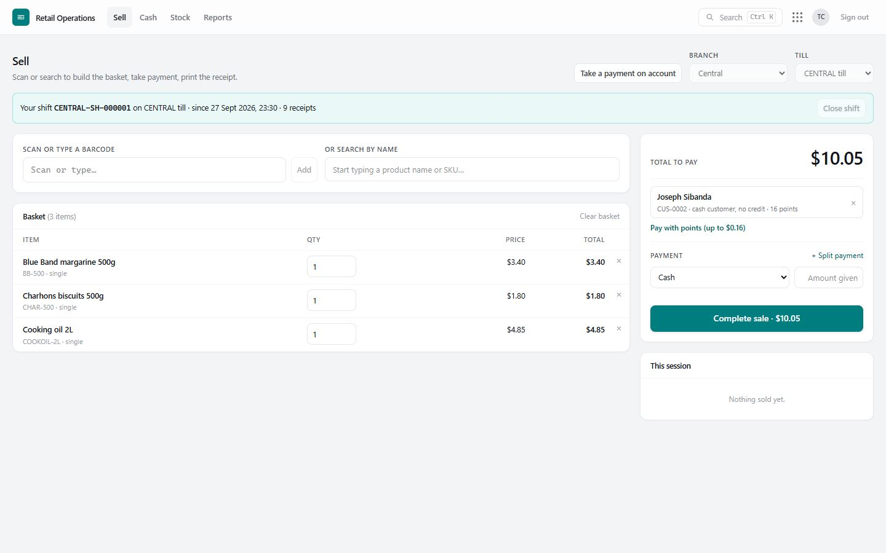
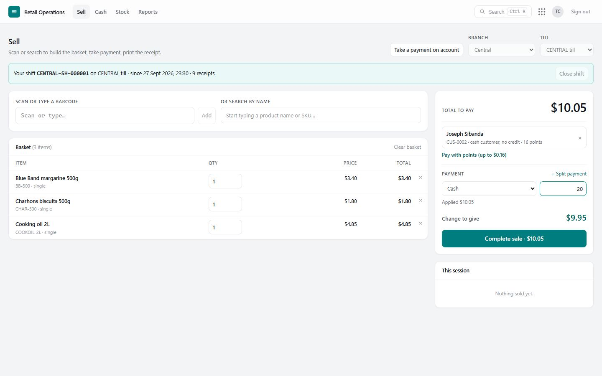
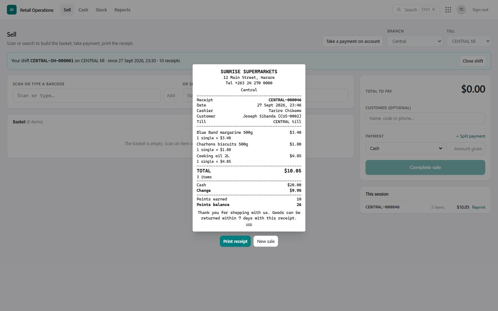

# 4. Selling at the till

The **Sell** screen is the till: build the basket, name the customer if there is one, take payment, print the receipt. A sale is one document — the stock leaving, the receipt, the payments and the cash landing in the till are saved together or not at all.

## Before the first sale

- **Branch and till** are chosen at the top right. Someone tied to one branch never has to choose it; a till is remembered on each computer.
- **Your shift.** If your business uses shifts, a bar under the title says whether you have one open. **Open shift** asks you to count the cash in the till; from then until you close it, the till is yours and nobody else can sell on it. See [Shifts, cash and end of day](05-cash-and-end-of-day.md).

## Building the basket

| To… | Do this |
|---|---|
| Add an item | Scan its barcode, or type the barcode and press Enter, or type part of the name in **search by name** and click it. Scanning the same item again adds one more. |
| Change the quantity | Type it on the line. Weighed items take decimals. |
| Remove a line | The **×** at the end of the line. |
| Sell at a different price, or give a discount | Type the new price or the discount on the line. **Needs the permission to change prices at the till**; every change is recorded as a *price override* exception with the money involved. |
| Sell an item that has no price yet | Not possible — a sale for nothing is worse than a refused one. Someone with price access can set the price right there, on the line. |

**An unknown barcode.** If a scan finds nothing, the till says the code is not in the item master and offers two things. **Log as unlisted scan** records it as an *unlisted barcode* exception, so goods sold "under the counter" become visible to a controller. **Add as a new item** (if you may add items at the till) takes a name and a price; the item is sold straight away and goes to a manager for review. The same **Add … as a new item** appears when a name search finds nothing.

**Not enough stock on record.** If a sale would take an item below zero, the till stops and says how many are on hand against how many are being sold. Someone with the permission to sell below zero sees **Authorise and sell anyway**; the sale goes through and becomes an exception so the stock can be checked. Anyone else reduces the quantity or asks a manager to sign in and complete the sale.

## The customer (optional)

Type a name, phone number or customer code in **Customer**. The chosen customer shows what they owe, their credit left, and their loyalty points.

- **Someone new?** If nothing matches, **+ Sign up a new customer** takes a name and phone number. They can earn points immediately; credit can only be given by a manager later.
- Naming the customer is needed to **charge their account** or **spend their points**, and it is how they **earn points**.

## Taking payment

The **Payment** box starts with one cash line.

| Method | How |
|---|---|
| **Cash** | Type the amount handed over. The change is shown in large figures. Only the cash that stays in the drawer is counted as takings. |
| **Mobile money / Card / Other** | Choose the method, type the amount and the transaction reference. |
| **On account (credit)** | Choose *On account*; the customer must be named and have enough credit left. |
| **Loyalty points** | **Pay with points** fills in as much as their points cover; or choose *Loyalty points* and type an amount. Needs whole points, and no more than they have. |
| **Split payment** | **+ Split payment** adds another line — e.g. $5 in cash and the rest by mobile money. |

The **Complete sale** button lights up when the payment covers the total. Anything that stops it is said in words beneath the payment box ("Choose the customer whose account this is charged to", "Rudo has 120 points (worth $1.20)").

## The receipt

**Complete sale** saves the sale and shows the receipt, ready to print. The receipt carries the business details, a gapless receipt number for the branch, date, cashier, customer, till, each line, total, payments, change, and — for a named customer — points used, earned and the new balance.

- **Print receipt** sends it to the till's printer; **New sale** clears the till for the next customer.
- **This session** on the right lists the last receipts from this till; **Reprint** any of them.
- If the connection drops while completing a sale, press **Complete sale** again: the same sale is recognised and you get the same receipt, never a second sale.

## Taking a payment on account

**Take a payment on account** (top of the Sell screen) records money a customer brings in towards what they owe: choose the customer, the amount and how they paid; cash goes into the till you choose. They get a numbered payment receipt (RCP-…).

## Good habits at the till

- Scan, don't type, wherever there is a barcode.
- Name the customer whenever they give a phone number — points bring them back.
- Never share an account or leave the till signed in; every sale carries the name of whoever is signed in.
