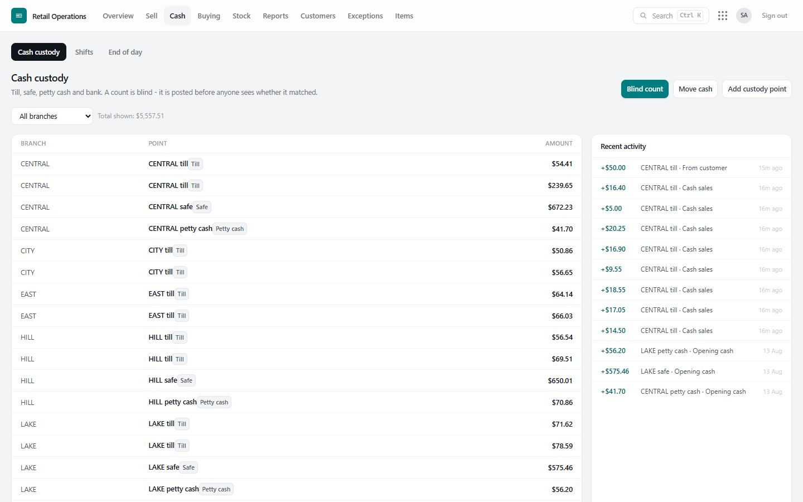
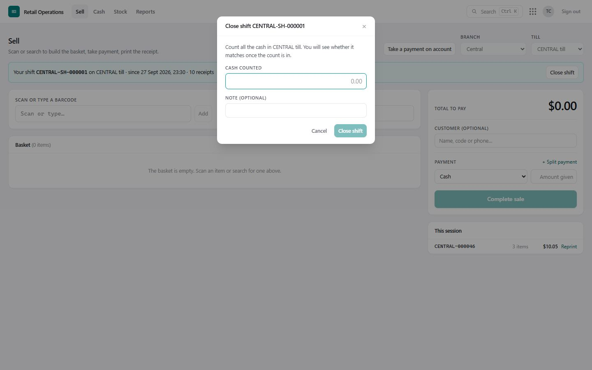
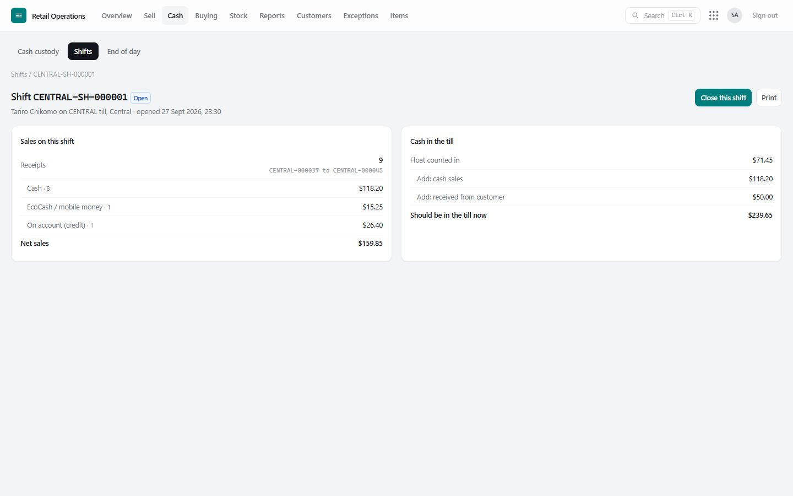
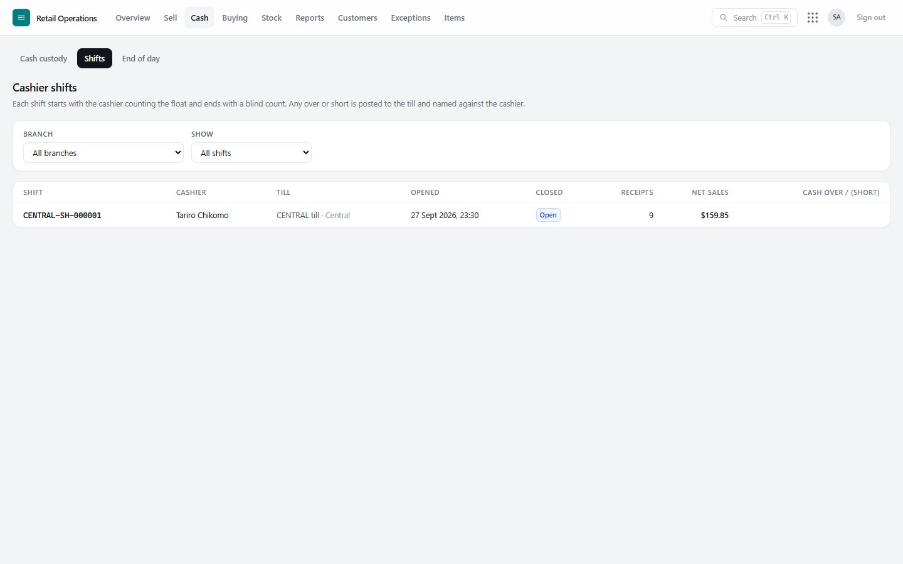
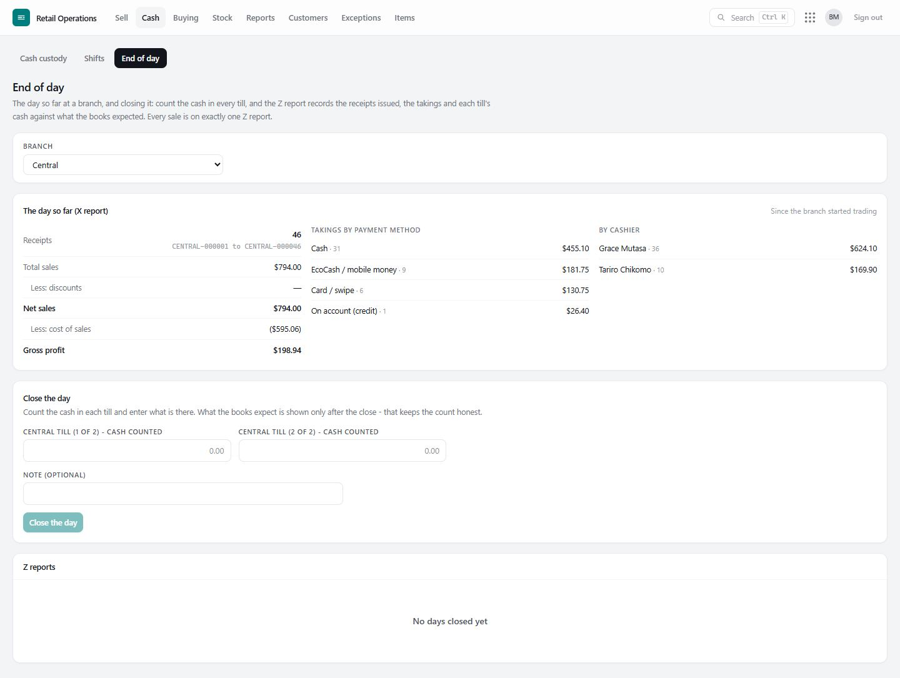

# 5. Shifts, cash and end of day

Cash is handled like stock: every dollar that moves is a record, so the cash a till *should* hold is always known — and whoever handled it is always named.

## Where cash is kept: custody points

**Cash › Cash custody** lists every place cash is kept at each branch — **tills**, **safes**, **petty cash** and the **bank** — with what each should hold now and its recent activity.

| To… | Button | Who |
|---|---|---|
| Add a till, safe or bank account (with its opening cash) | **Create custody point** | Supervisor, manager |
| Move cash: **float issue** (safe → till), **float return** (till → safe), **bank deposit** (safe → bank) | **Move cash** | Supervisor, manager |
| Count the cash somewhere | **Blind count** | Cashier and up |

A **blind count** never shows what the books expect until the count is in. A cashier cannot even ask the system for the expected figure. Any difference is posted to that cash point and becomes a *cash variance* exception.

## Cashier shifts

A shift is one cashier's session on one till: it starts with counting the float in and ends with counting the cash out.

**Opening a shift** (on the Sell screen): **Open shift** → count the cash in the till → **Open shift**. If the count differs from what the till should hold, the difference is posted immediately and raised as an exception — so the new cashier never inherits someone else's shortage. From now on the till is theirs: nobody else can sell on it.

**Closing a shift**: **Close shift** → count all the cash (blind) → **Close shift**. The cashier then sees their **shift report**: what should have been in the till, what they counted, and any over or short — which is posted to the till and raised against their name.

**The shift report** explains the expected cash line by line: the float counted in, plus cash sales, plus customer payments taken, less float returned to the safe, less cash paid out to suppliers… = what should be in the till. It also shows the receipts rung up (first and last number), and takings by payment method.

**Supervisors** see every shift in **Cash › Shifts** — who, which till, when, receipts, sales, and over/short — and can close a shift a cashier left open.

**Required or optional?** In **Settings**, *Tills need an open shift to sell*:
- **no** (default): shifts are optional; a cashier who opens one gets the protection and the report.
- **yes**: a till refuses to sell until the cashier has opened their own shift on it, and end of day waits until every shift at the branch is closed.

## End of day: the X and Z reports

**Cash › End of day** (supervisors and managers).

**The X report** is the day so far at the branch, since the last close: number of receipts (first to last), total sales, discounts, net sales, cost of sales, gross profit, takings by payment method, and sales by cashier. Look at it any time; it changes nothing.

**Closing the day (Z report):**

1. Count the cash in **every till** and enter each figure. The screen does not show what the books expect — the count stays honest.
2. **Close the day** → **Yes, close the day**.
3. The Z report is issued: a numbered, unchangeable record of the day — the receipts it covers, the takings, and each till's cash **expected, counted and over/short**. Any difference is posted to the till and raised as an exception.

**Every sale is on exactly one Z report.** A Z report covers a *range of receipt numbers*, starting exactly where the previous one ended. A sale rung up while the day is being closed simply falls into the next one — never both, never neither.

Past Z reports are listed under the close form, and anyone with sales access can open and print them.

## Paying suppliers and receiving customer money in cash

- **Paying a supplier in cash** (Buying › Payments) asks which till or safe the cash came out of, and refuses if it does not hold enough. It shows in that till's shift report.
- **A customer paying their account in cash** (Sell › *Take a payment on account*) asks which till or safe it went into.

## Good practice

- Open a shift for every cashier, every day — even when shifts are optional. It is the only way a shortage has a name.
- Move surplus cash from the tills to the safe during the day (**Move cash › Float return**); it reduces risk and makes counts quicker.
- Close the day every day. Clear the cash exceptions the next morning with a note of what was found.
