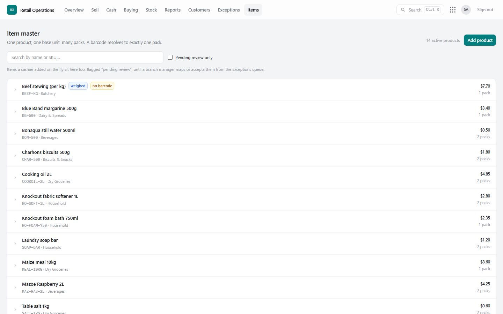
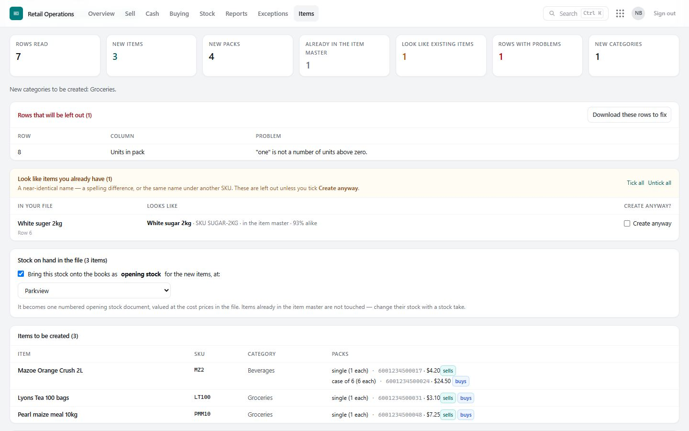
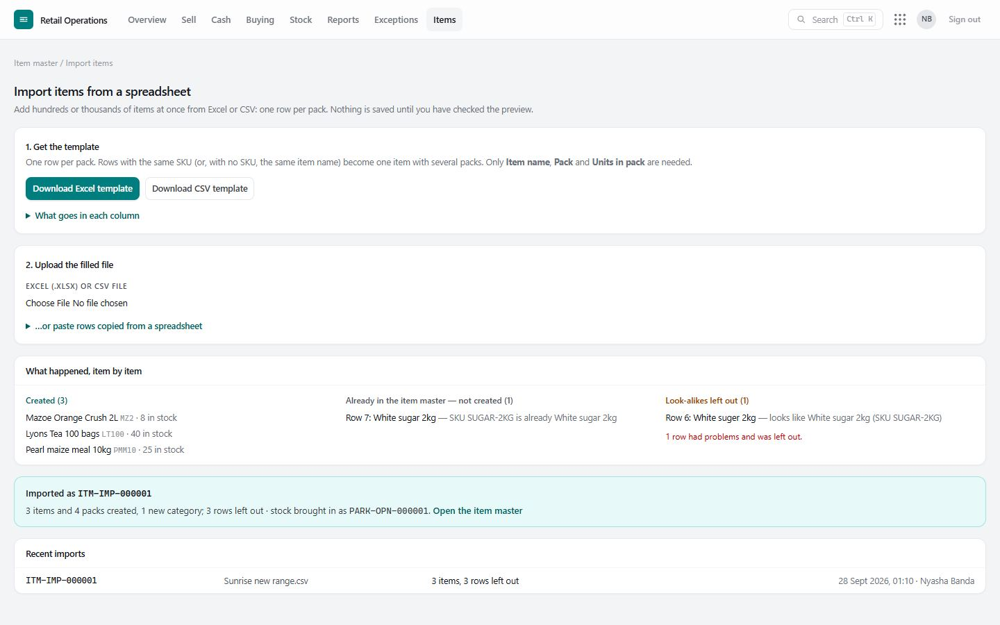
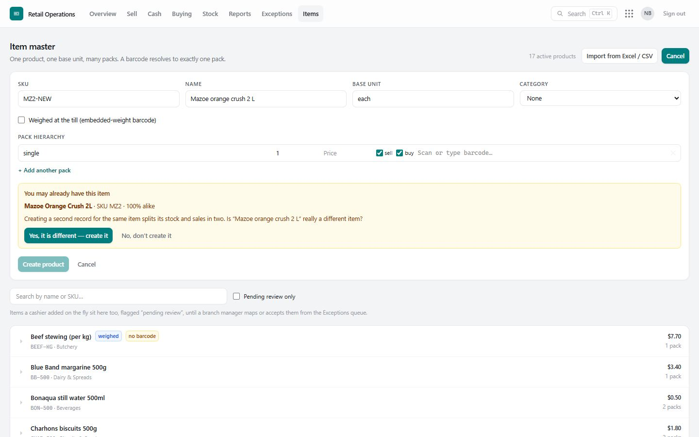
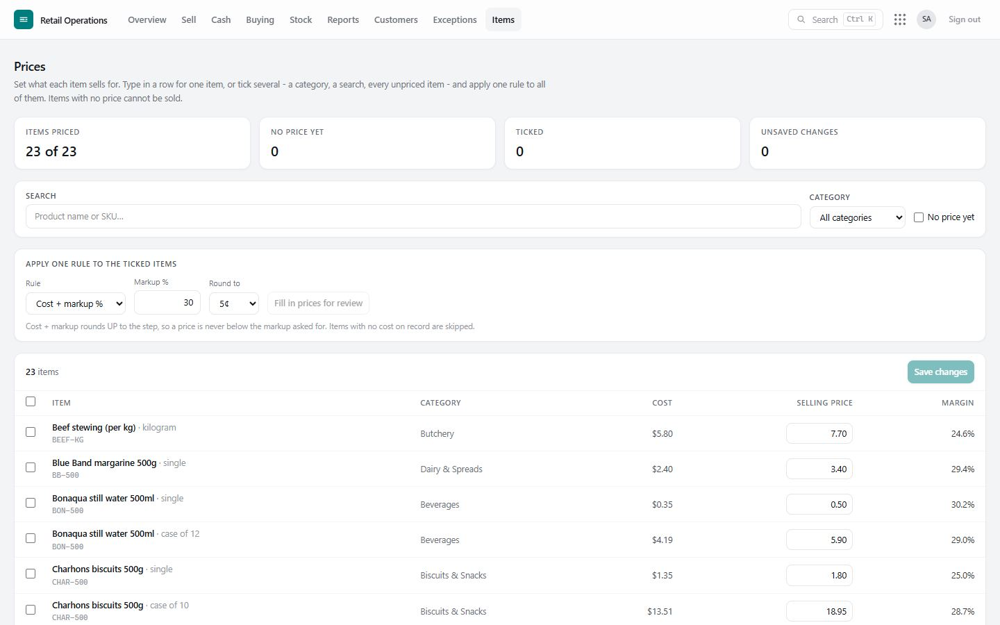
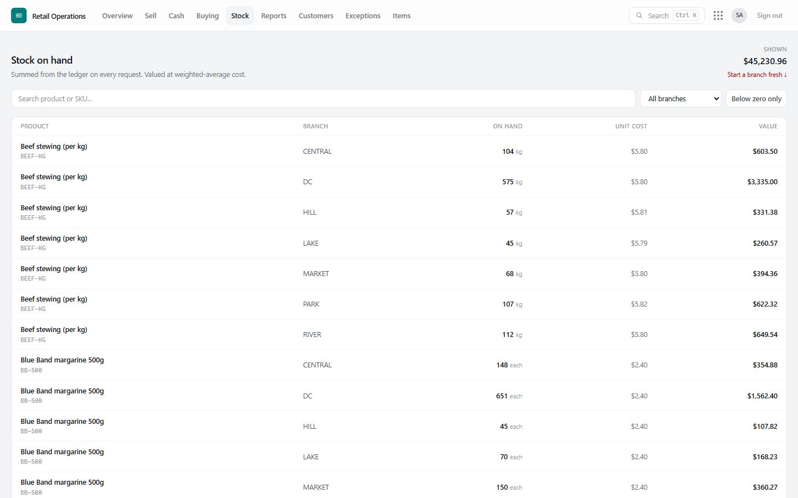
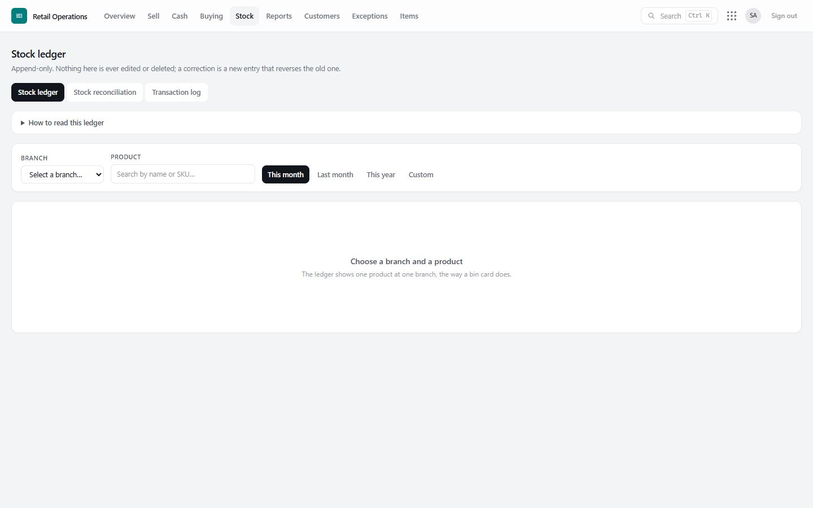
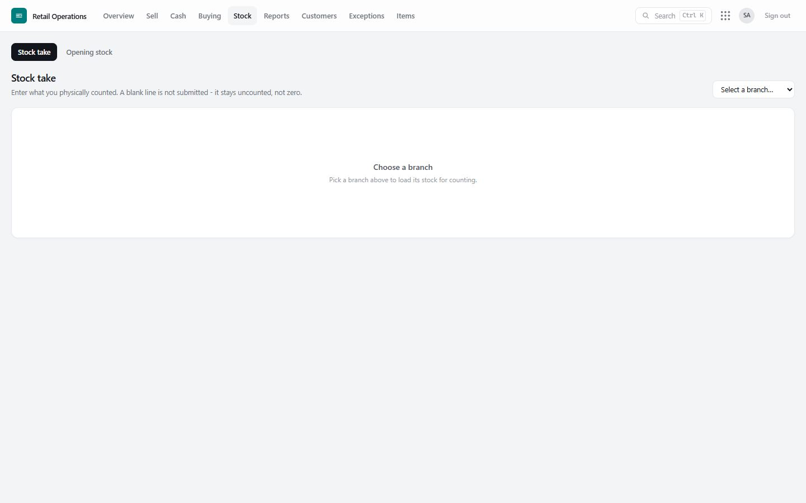
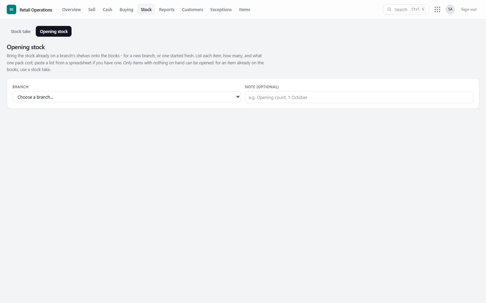
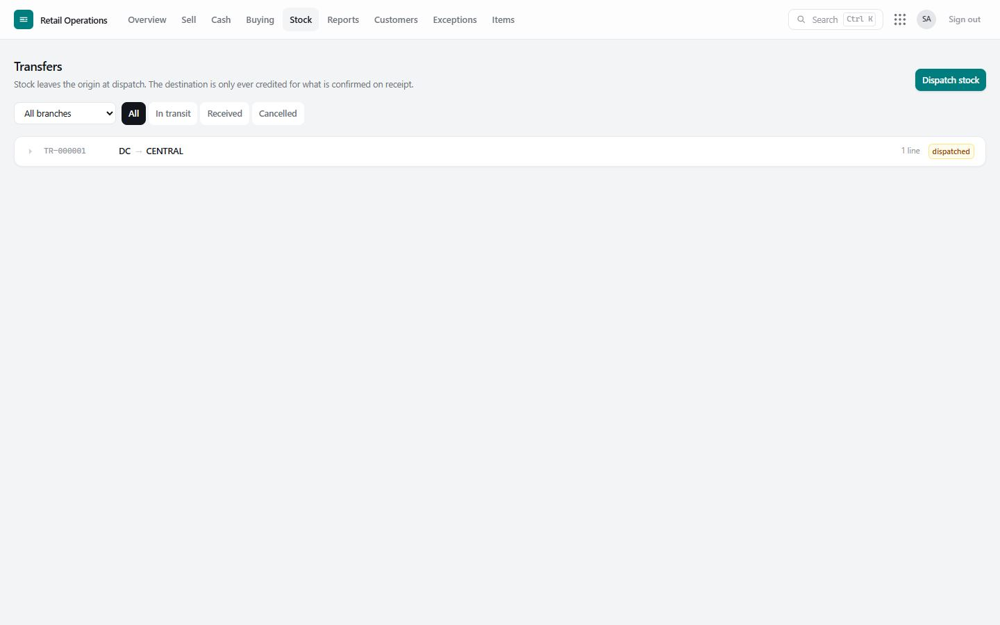

# 6. Items, prices and stock

## The item master

**Item master** holds every item the group sells, once, with its **packs** and **barcodes**. A pack is a way the item is sold or bought — a *single*, a *bale of 10*, a *case of 24* — each with its own barcode and selling price, and all counted in the same **base unit** so stock adds up across packs.

| To… | Do this |
|---|---|
| Add an item | **Add product**: name, SKU, category, base unit; then open it to add its packs and barcodes. |
| Add a pack or barcode | Open the item and add it; a barcode can belong to one pack only. |
| Review items added at the till | They are marked **pending review** here, and each one is waiting in the **Exceptions** queue (*Product added at the till*), where a manager approves it or **merges** it into the item it duplicates — its history moves with it. |
| Find messy data | Items with no pack or no barcode are flagged, not hidden. |

## Importing items from Excel or CSV

For a new shop, or a big range change, add hundreds or thousands of items at once: **Item master › Import from Excel / CSV**.

**1. Get the template.** **Download Excel template** (or CSV). It has the right columns, example rows, and a second sheet, *How to fill this in*, explaining every column. One row is one **pack**; rows with the same SKU (or, with no SKU, the same item name) become **one item with several packs**.

| Column | Needed? | What to put |
|---|---|---|
| SKU | optional | Your code for the item. Blank: one is made up (ITM-000123). |
| Item name | **needed** | The item as customers know it, without the pack — *White sugar 2kg*. |
| Category | optional | Created if it does not exist yet. |
| Base unit | optional | What stock is counted in: each, kg, litre, box. Default *each*. |
| Weighed | optional | *yes* if sold by weight. Default *no*. |
| Pack | **needed** | single, bale of 10, case of 24… |
| Units in pack | **needed** | 1 for a single, 10 for a bale of 10. |
| Barcode | optional | 8, 12 or 13 digits, or your own code. One barcode, one pack. |
| Selling price | optional | Set only if you have price access; otherwise left for the Prices screen. |
| Sell this pack / Buy this pack | optional | *yes* for the pack the till sells by default / you order by. Default: smallest / largest. |
| Cost price | optional | What one of this pack cost you. |
| Stock on hand | optional | How many of this pack are on the shelf now (on one pack row per item). |

> **Tip:** in Excel, format the Barcode column as **Text** before typing, or long barcodes turn into numbers like 6.0E+12. The import spots this and tells you which rows to fix.

**2. Upload it** — Excel (.xlsx) or CSV — or paste rows copied from a spreadsheet. **Nothing is saved yet**: every row is checked and the preview shows

- how many rows were read, new items and packs, and new categories;
- **rows with problems**, by row and column (*Row 12, Units in pack: "two" is not a number*) — **Download these rows to fix**, correct them, upload them again;
- **items already in the item master** — skipped, with the reason;
- **items that look like ones you already have** — see below;
- the **stock on hand** in the file, if any.

**3. Import.** All the new items are created together, or none are. You stay on the same screen and get the report, item by item: what was created (with its stock), what was already there, and which look-alikes were left out. Each import is numbered (ITM-IMP-000001), listed under *Recent imports*, and recorded in the audit log.

### How duplicates are prevented

Two records for one item split its stock and its sales in two, so the import is strict:

| The row… | What happens |
|---|---|
| has a **SKU** already in the item master | **Not created.** Shown as *already in the item master*. |
| has a **barcode** already on another item | **Not created.** |
| has the **same name** as an existing item — ignoring capitals, spaces, punctuation and how units are written (*2 kg* = *2kg*, *litre* = *l*) — and no SKU | **Not created.** |
| **looks like** an existing item — a spelling difference (*Suger 2kg* / *Sugar 2kg*), or the same name under a different SKU | **Held back** under *Look like items you already have*, beside the item it resembles and how alike they are. **Created only if you tick *Create anyway*.** |
| looks like **another row of the same file** | Held back the same way, pointing at that row. |

Sizes count: *Sugar 1kg* and *Sugar 2kg* are different items and are never flagged as look-alikes. Importing the same file twice creates nothing the second time.

### Bringing in stock with the items

If the file has **Stock on hand**, tick *Bring this stock onto the books as opening stock* and choose the **branch** it is at. The new items' stock becomes one numbered [opening stock](#opening-stock) document, valued at the file's **cost prices**. This needs the permission to bring in opening stock. Items already in the item master are never touched — their stock changes through a stock take.

### Adding one item: the same protection

**Add product** checks too. If an item with the same or a near-identical name exists, it stops and shows it: *"You may already have this item … Is this really a different item?"* — **Yes, it is different — create it**, or **No, don't create it**. A SKU that already exists is refused outright.

## Prices

**Prices** shows every pack with its **cost**, **selling price** and **margin**.

- **One price:** type it in the row.
- **Many at once:** tick items (a category, a search, every unpriced item) and apply a rule — *an exact price*, *a percentage up or down*, or *cost plus a markup*. The new prices are shown for review; nothing changes until **Save**.
- **Every unpriced item at once:** show only items with *no price yet*, tick them all, and apply *cost plus a markup* (rounded up). Items with no known cost are left for you to price by hand.
- **From a supplier's price list:** see [Buying › Supplier price lists](07-buying.md#supplier-price-lists).

Every price change is recorded in the [audit log](09-reports-and-controls.md#the-audit-log) with the old and new price and who made it. An item with no price cannot be sold.

## Stock on hand

**Stock on hand** shows what each branch holds, item by item, and what it is worth at cost. **Below zero only** lists the positions the records say are impossible — where selling below zero has been authorised and a count is due.

## The stock ledger

**Stock ledger** is the bin card, in the form an accountant reads it:

- **Stock ledger** — one item at one branch: *opening balance b/f*, each receipt and issue with a running balance, *closing balance c/f*, and a line proving it agrees with stock on hand.
- **Stock reconciliation** — every item at a branch on one page: *opening + receipts − issues = closing*, with separate columns for purchases, transfers in and out, sales, returns, stock-take adjustments and opening stock introduced.
- **Transaction log** — every movement, newest first, including how long after the event it was recorded (late entries are flagged).

## Stock take

**Stock entry › Stock take**: choose the branch, count, type what is on the shelf. Only items you typed a count for are posted — an item left blank stays as it was; it is never assumed to be zero. Posting writes each difference to the ledger, valued at average cost, and differences become *count variance* exceptions.

## Opening stock

**Stock entry › Opening stock** brings the stock already on a branch's shelves onto the books — for a new branch, or when starting fresh. Search items or **paste a list from a spreadsheet** (item, quantity, cost per pack). Items that already have stock at the branch are flagged: those need a stock take instead. Posting creates one numbered document (OPN-…), and a work item for the auditor to check it.

## Transfers between branches

**Transfers** moves stock from one branch (or the distribution centre) to another in two steps, done by different people:

1. **Dispatch** at the sending branch — stock leaves immediately and is *in transit*.
2. **Receive** at the receiving branch — they confirm what actually arrived. Shortages or extras are costed and raised as *lost in transit* exceptions.

## Starting a branch fresh

A branch manager can set every item at a branch to zero (**Stock on hand › Start a branch fresh**), for example before a full opening count after moving from another system. It cannot be undone, asks for confirmation, is recorded as one document and is raised as an exception.
