# 7. Buying from suppliers

Everything to do with suppliers sits under **Buying**, with a tab for each step:

**Suppliers → Orders → Goods received → Returns → Price lists → Payments → Owed to suppliers**

## Suppliers

**Buying › Suppliers** lists every supplier with their terms (cash or credit, days to pay), orders awaiting delivery, the last delivery, and the balance — what you owe them, or have prepaid.

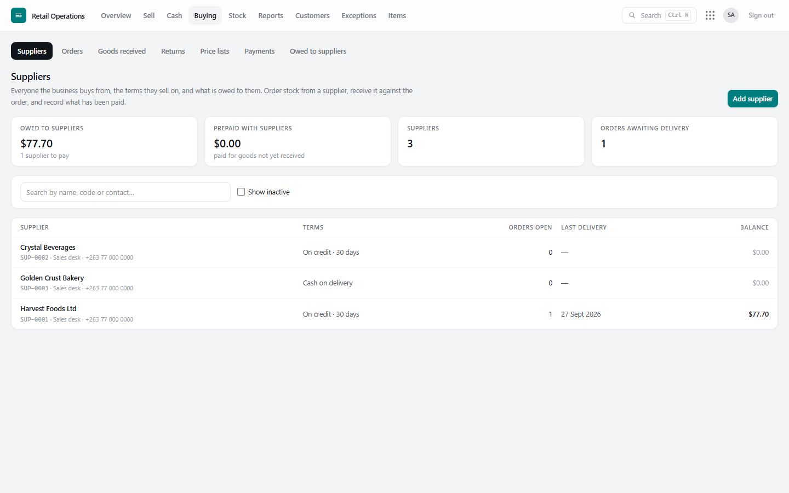

Open a supplier for their **account statement**: every delivery, payment and return in date order with a running balance, what is overdue and by how long, their orders, and their price lists. Print it to send to the supplier.

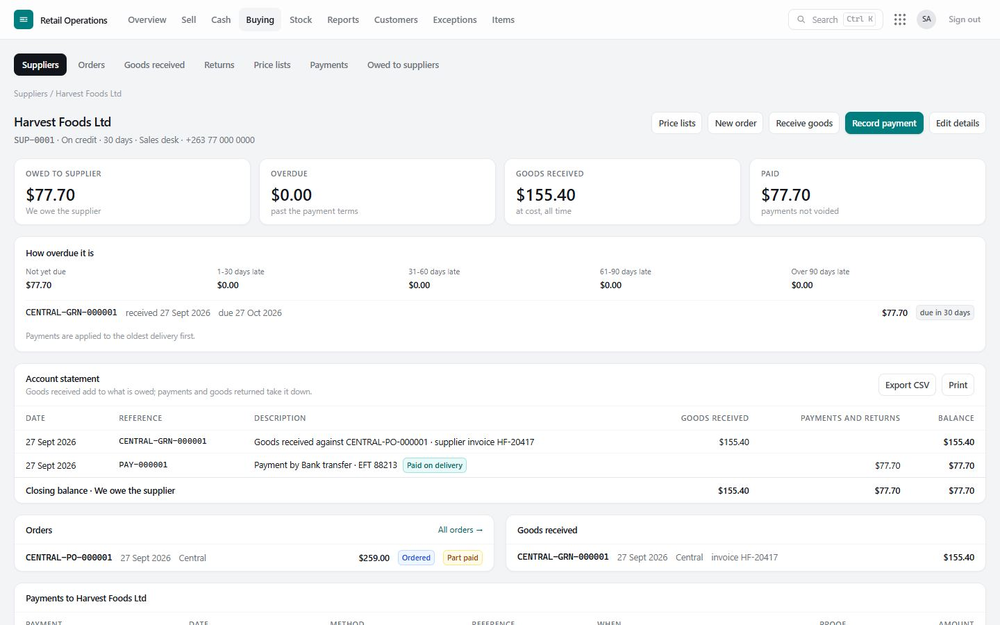

> Staff tied to one branch see their suppliers and deliveries, but not the group's balances with them — that is group finance.

## Purchase orders

**Buying › Orders › New purchase order**: supplier, branch to deliver to, expected date, payment terms, and the lines (item, pack, quantity, price per pack). If the supplier has sent a price list, each line starts at **their current price**.

An order moves through: **Ordered → Part received → Received**, or **Closed short** (the rest will not come) or **Cancelled**. It also shows whether it is **Unpaid / Part paid / Paid**.

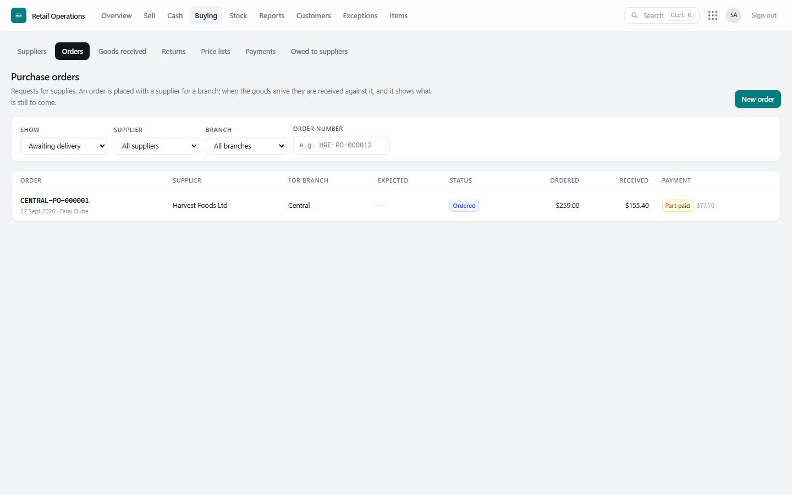

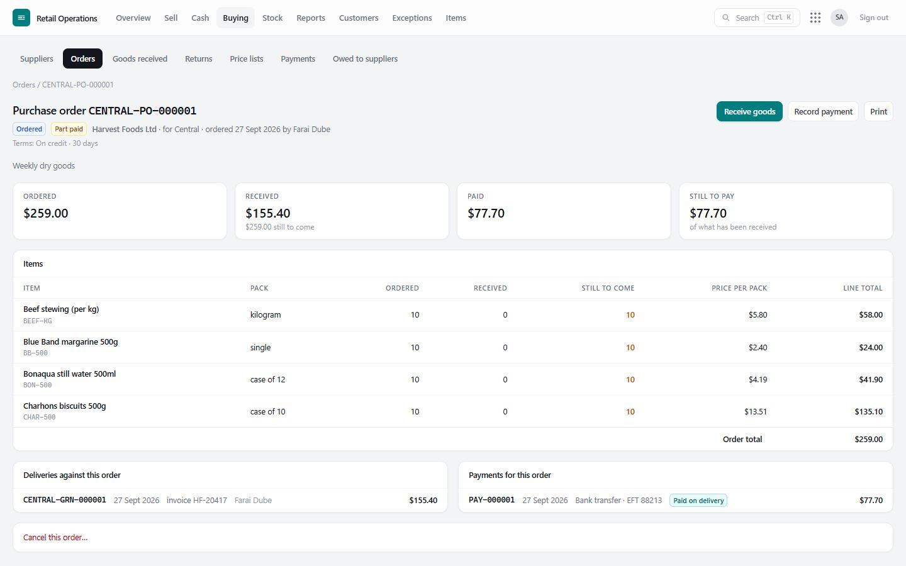

## Goods received

**Buying › Goods received** records a delivery. Choose the supplier and branch, optionally **Against order** (the ordered lines fill in, with what is still to come), then enter what actually arrived and the price per pack **from the invoice**, with the invoice number, date and total.

- If the supplier has a price list on record, their list price shows beside each line as a hint — but the cost recorded is always the invoice's.
- If the lines do not add up to the invoice total, the screen warns you before posting.
- Posting creates a numbered **goods received note** (GRN), puts the stock on the books at the branch, and updates the item's average cost.

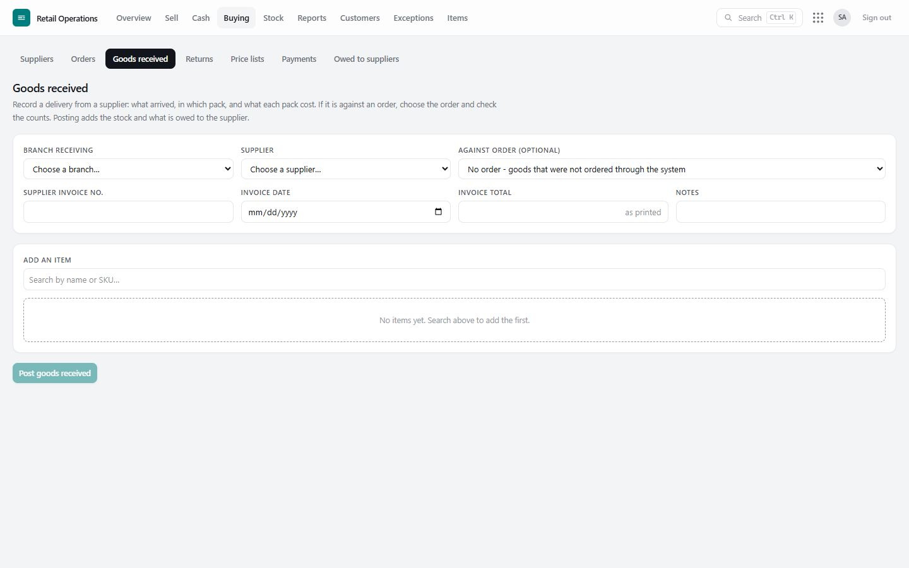

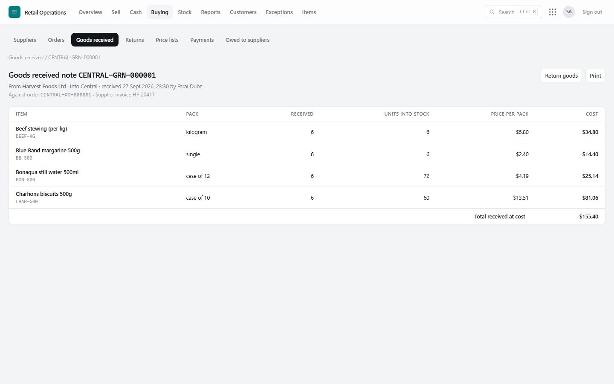

## Returns to suppliers

**Buying › Returns › Return goods to a supplier**: choose the delivery the goods came from; the screen shows what can still go back from it. Enter what is being returned and the supplier's credit note number if there is one. Posting creates a numbered **purchase return note** (PRN), takes the stock off the books, and reduces what you owe the supplier.

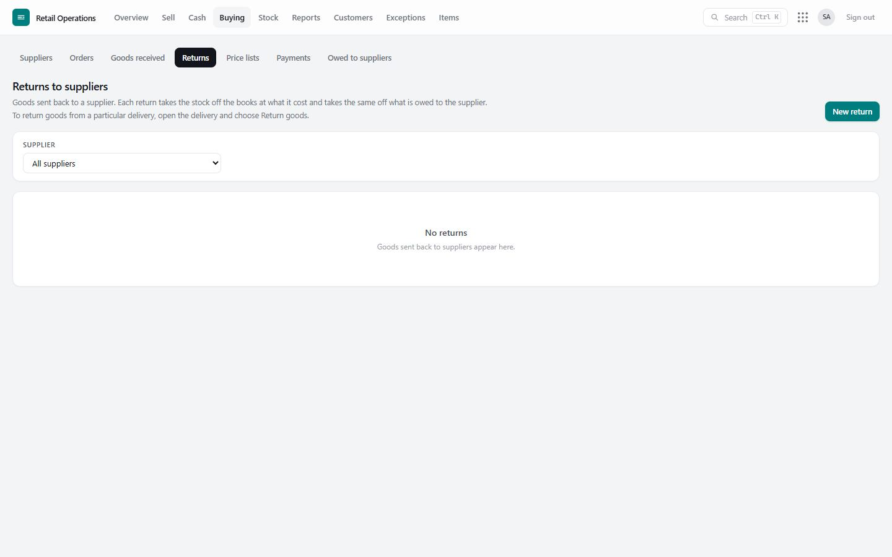

## Supplier price lists

When a supplier sends new prices, **Buying › Price lists › Import a price list**:

1. **Choose the supplier**, then **paste the list** (straight from Excel, an e-mail, or a PDF) or **open a CSV file**. One item per line: the code first, the price per pack last. The code can be the supplier's own code, a barcode, or your SKU.
2. **Choose how your selling prices should follow:**
   - **Keep each item's margin** — the price moves in proportion to the cost;
   - **Cost plus a markup** — e.g. 25 %;
   - **Record costs only** — selling prices are left alone.

   Suggested prices are rounded **up** (to 1c, 5c, 10c, 50c or $1) so the margin is never less than intended.
3. **Preview.** Every matched line shows old → new cost (and the % change), the price now, the suggested new price (which you can change), and the margin before → after. Lines that could not be matched are listed with the reason. Nothing has changed yet.
4. **Tick the lines to apply** and **Apply**. A price below its new cost is refused.

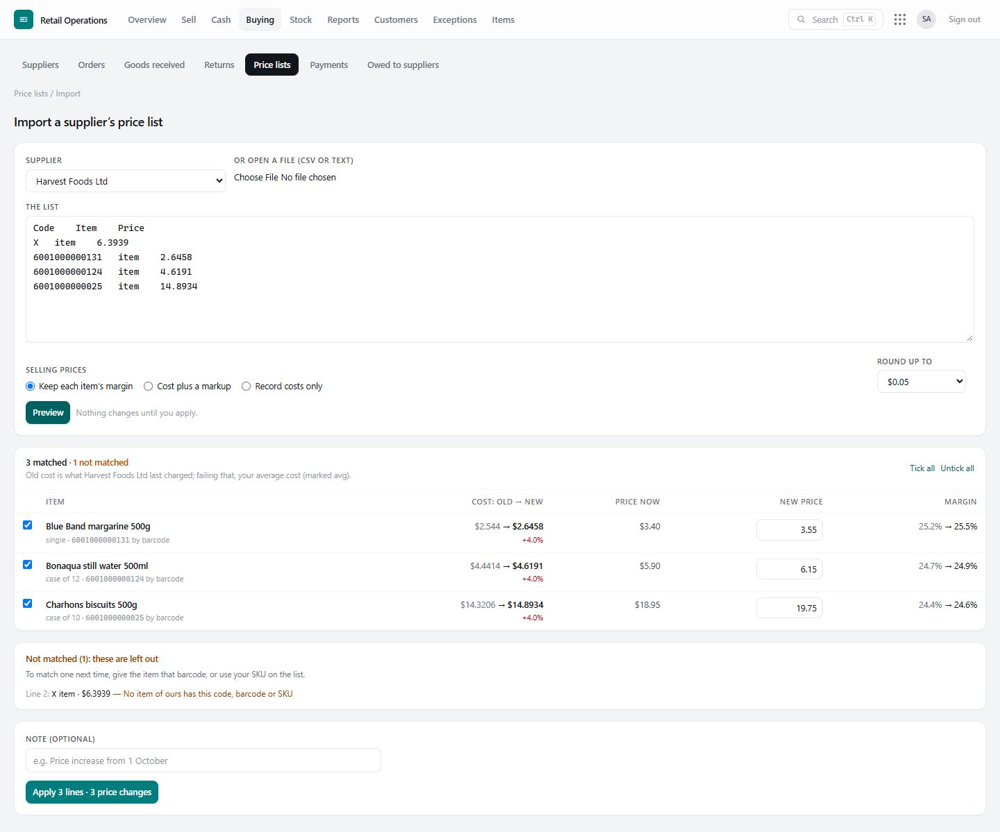

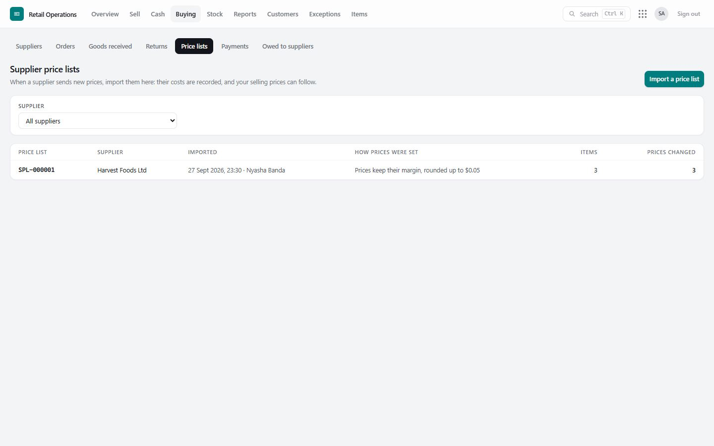

The result is a numbered, unchangeable **price list** (SPL-…) recording, for each item, the old and new cost and price. The supplier's costs are remembered: their own codes match the next list automatically, and their prices fill in new orders. Every price change is audited with the list it came from.

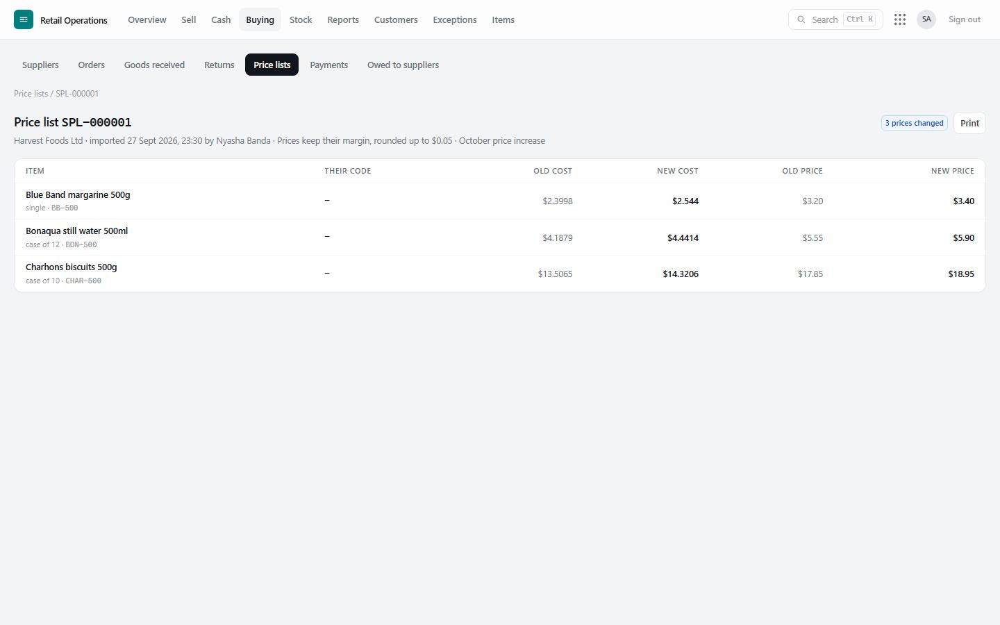

## Paying suppliers

**Record payment** (on an order, a delivery or the supplier's page) — finance only:

- **Method:** cash, bank transfer, mobile money, cheque, card. Anything but cash needs its reference.
- **Cash** asks which till or safe it came out of, and refuses if that place does not hold enough.
- **Proof:** attach a photo or screenshot of the transfer or receipt.
- **Tie it** to the order (a prepayment) or the delivery. It is labelled automatically: **Prepaid**, **Paid on delivery**, **Paid after delivery**, or **On account**.
- A payment made by mistake is **voided** with a reason, never deleted.

**Buying › Payments** lists every payment, filterable by supplier and method, including those **without proof**.

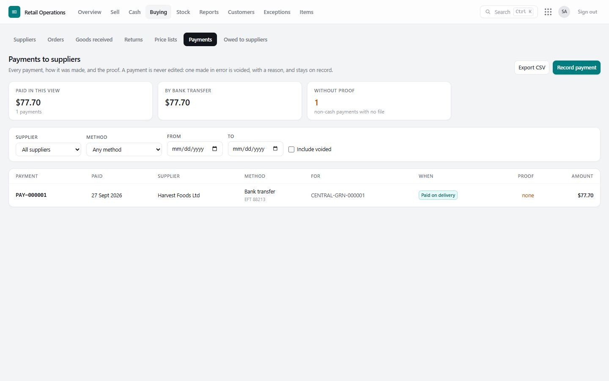

## Owed to suppliers

**Buying › Owed to suppliers** is the aged creditors list: for each supplier, what is **not yet due** and what is **overdue** by age band, and anything **prepaid**. Print it for the month-end.

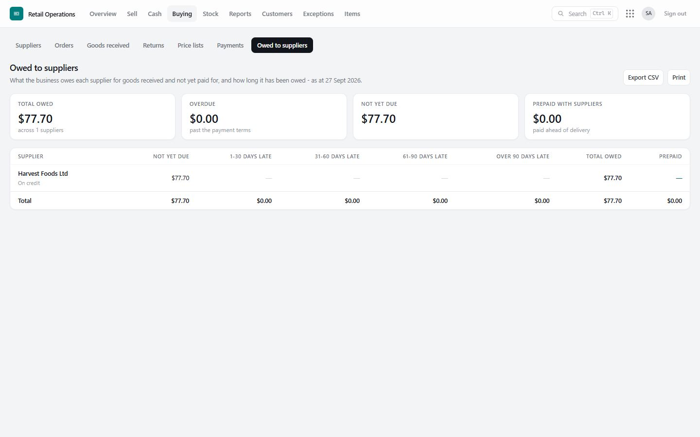
