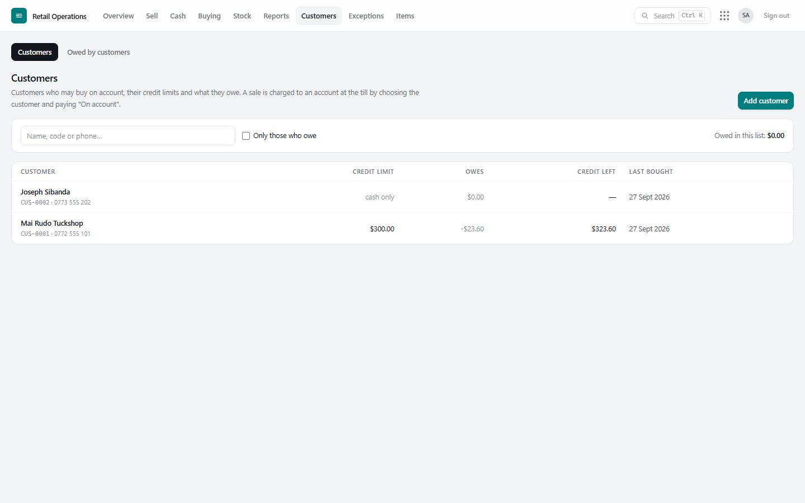
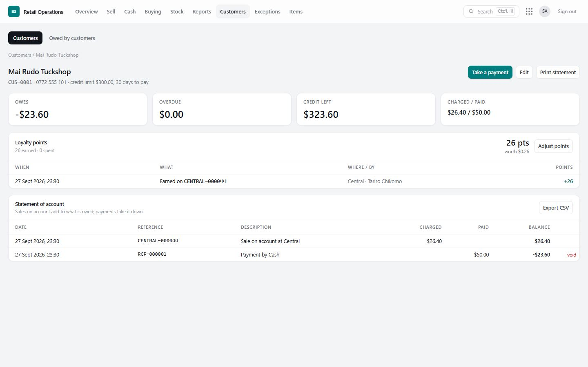
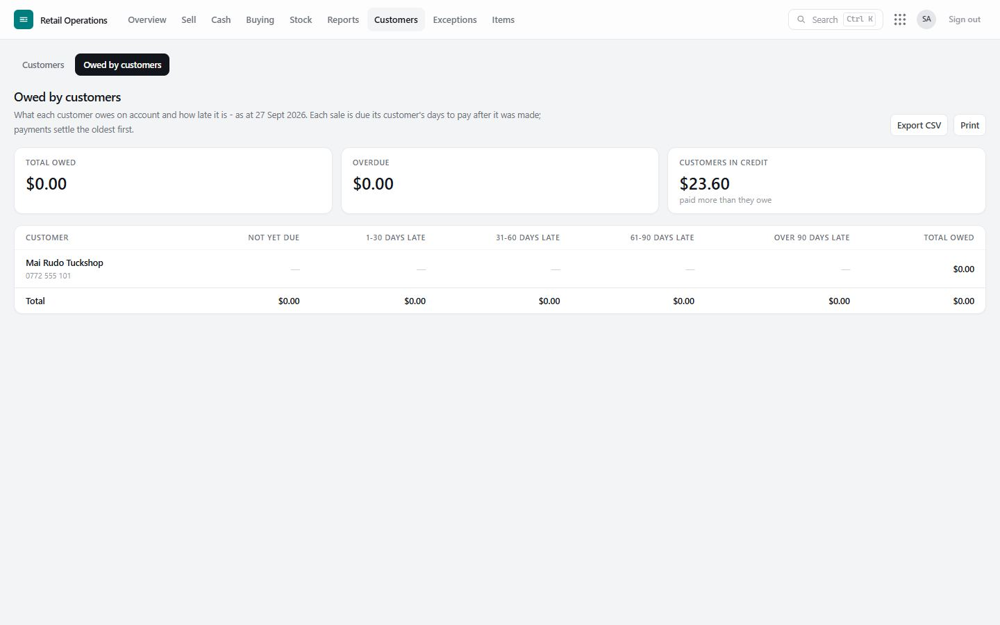
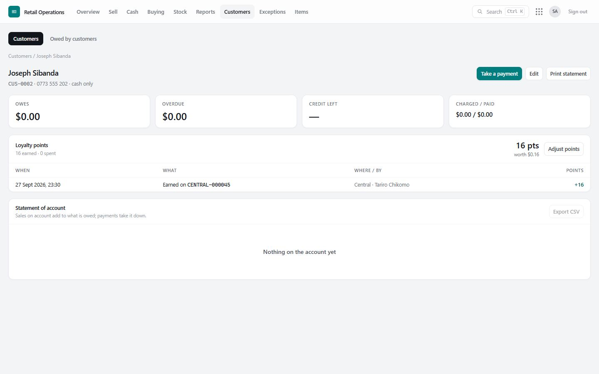

# 8. Customers, credit and loyalty

## Customers

**Customers** lists every customer with their credit limit, what they owe, credit left, and when they last bought. Customers are added two ways:

- **At the till** — a cashier signs someone up with a name and phone number (**+ Sign up a new customer**). They can earn points straight away; they have **no credit**.
- **By a manager or finance** — **Add customer** with full details, a **credit limit** and **days to pay**.

A phone number belongs to one customer only, so the same person is not signed up twice.

## Selling on credit

At the till, choose **On account (credit)** as the payment method and name the customer. The sale goes through only if it fits within their **credit left**; two tills charging the same customer at the same moment cannot both squeeze under the limit.

Raising a customer's credit limit is recorded and raised as an exception (*credit limit raised*) for a second person to check.

## A customer's account

Open a customer for:

- **Owes · Overdue · Credit left · Charged / paid** at the top;
- the **statement of account** — every sale on account and every payment, in date order, with a running balance (**Print statement**, or export to CSV);
- their **loyalty points** and points history.

**Receiving a payment**: **Take a payment** here, or **Take a payment on account** on the Sell screen. Cash goes into a named till or safe; other methods need a reference. Each payment gets a numbered receipt (RCP-…). A payment recorded by mistake is voided with a reason.

## Owed by customers

**Customers › Owed by customers** is the aged debtors list: each customer's balance split by how overdue it is, with totals. Print it for the month-end or for collections.

## Loyalty points

Loyalty is switched on in **Settings** (*Loyalty points: yes*), where you also choose:

| Setting | Example | Meaning |
|---|---|---|
| **Points earned per dollar** | 1 | One point for each whole dollar paid. 0.5 = a point every $2. Always rounded down. |
| **Value of one point** | $0.01 | 100 points pay $1.00 at the till. |

**Earning.** A named customer earns points on what they pay — cash, card, mobile money or account — but not on the part they paid with points.

**Spending.** At the till, **Pay with points** (or choose *Loyalty points* as a payment method). The till checks they have enough; two tills cannot spend the same points.

**On the receipt:** points used, points earned, and the new balance.

**Adjusting.** A manager can add or take away points on the customer's page (**Adjust points**), always with a reason — for a complaint, a promotion, a correction. Points are worth money, so every adjustment is raised for review with its value.

Points are kept as a ledger like stock and cash: the balance is the sum of every earn, spend and adjustment, each naming the receipt or the person behind it.
