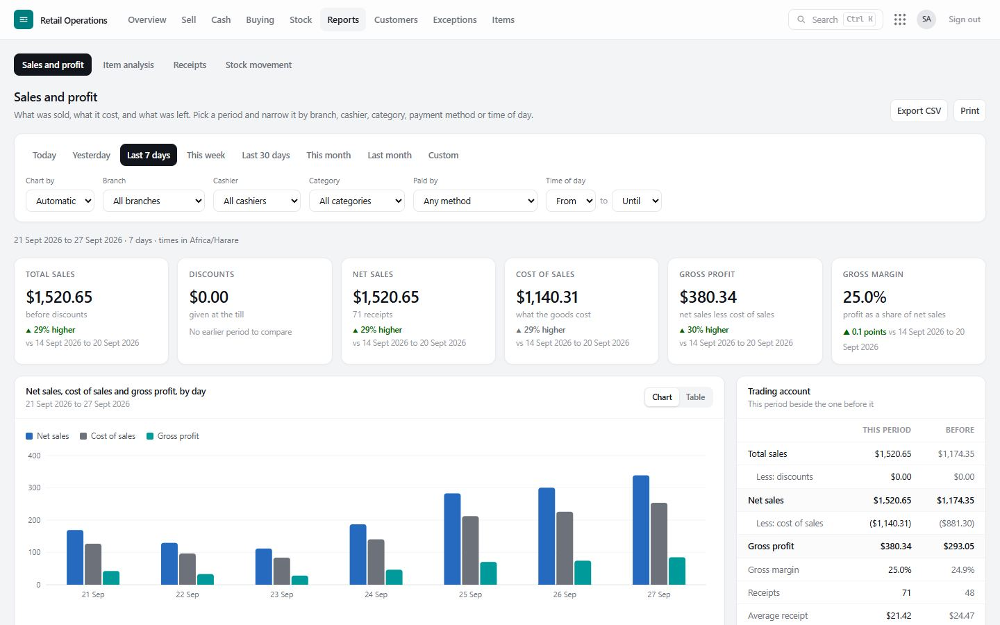
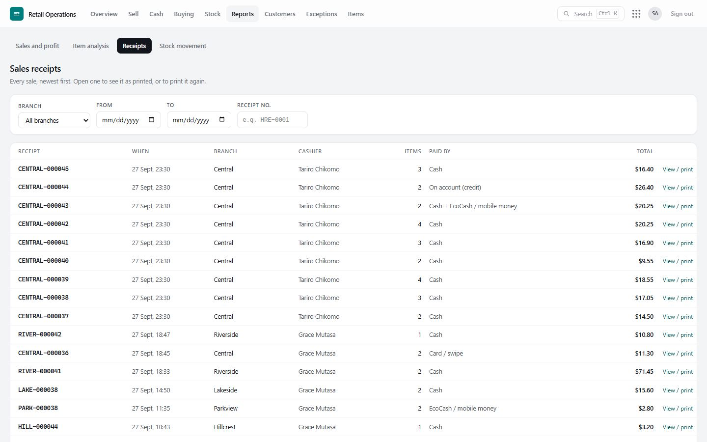
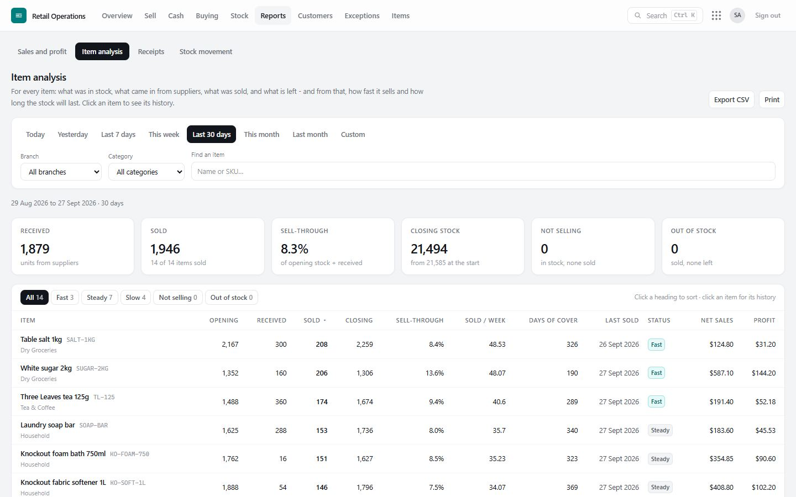
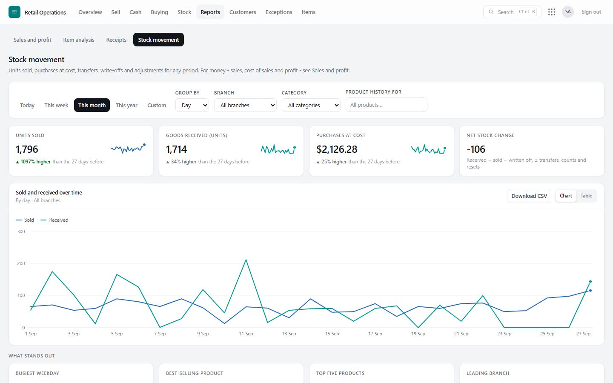
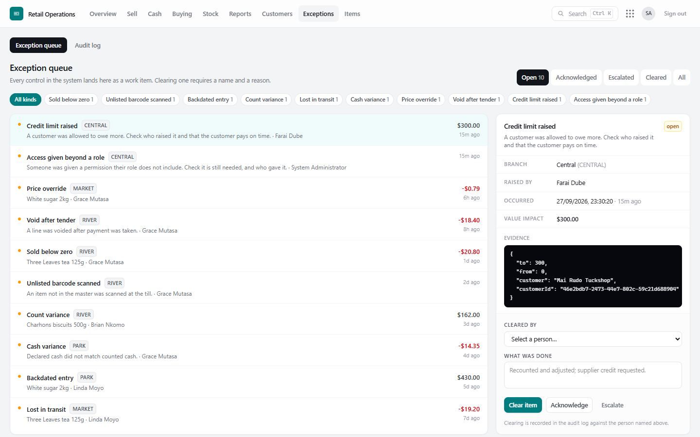
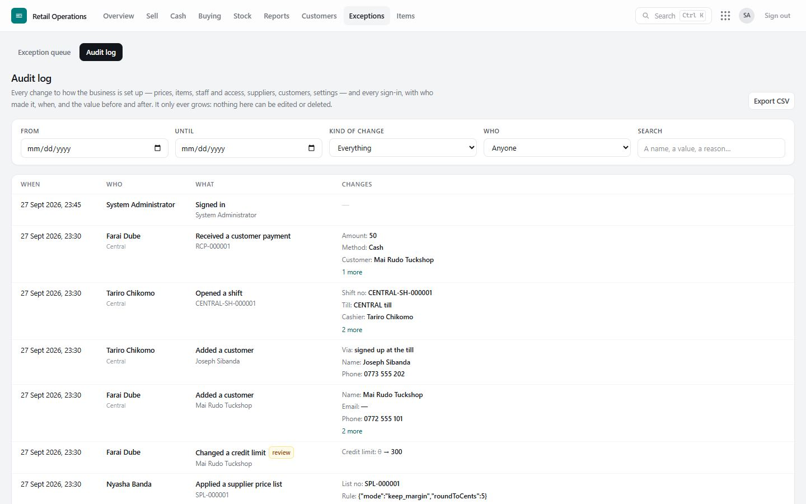

# 9. Reports and controls

## Insights: what needs attention

**Reports › Insights** reads the business's own records and lists what needs attention, most serious first (*Act now*, then *Worth a look*). Each card gives the figure, a few named examples, and a button to the screen where it is dealt with. Nothing is guessed: each is a plain rule, and a rule that finds nothing is not shown.

| Insight | What it looks for | Where it is fixed |
|---|---|---|
| **Prices below cost** | A pack selling for less than it costs (average cost) | Prices |
| **Margin under 5%** | Priced barely above cost | Prices |
| **Costs rising** | The latest delivery cost is well above the average and, at that cost, the margin is under 10% | Prices |
| **Selling but out of stock** | Sold in the last 30 days, none left at that branch | Reorder |
| **Stock not selling** | Money in stock that has not sold for 90 days | Not moving |
| **Stock-take losses** | Shortages found at counts in 90 days, by branch | Exceptions |
| **Cash short** | Till and shift shortages in 90 days, by who was on the till - a name short three times or more is flagged | Exceptions |
| **Exceptions left open** | Open for more than a week | Exceptions |
| **Items that need finishing** | No selling price, waiting for review, or no barcode | Item master |

Branch managers see their own branches; choose one branch or all of them at the top.

## The overview

**Overview** is the first screen for managers and owners: today's trading, stock position and value, what is owed to suppliers, and the exceptions waiting — for the whole group or one branch. It works well on a phone.

## Sales and profit

**Reports › Sales and profit** — for any period (day, week, month, year or your own dates), branch, category, cashier or payment method:

- the **trading account**: sales, discounts, net sales, cost of sales, gross profit and gross margin;
- **this period beside the one before it**;
- a chart by hour, day, week or month, and **time of day**;
- **where the sales and profit come from**: by branch, category, item, cashier, payment method;
- **sales with no cost on record** shown separately, never guessed.

**Reports › Sales receipts** lists every receipt; open any one to see or reprint it.

## Item analysis

**Reports › Item analysis** — for each item: units sold per week, sell-through, **days of cover** at the current rate of sale, and a status: **Fast**, **Not selling**, **Out of stock**. Open an item for its full sales and stock history. *How these figures are worked out* explains each measure on the page.

## Stock movement

**Reports › Stock movement** — by week, month or year: opening stock, purchases, transfers, sales, adjustments and closing stock, in units and value, reconciling period by period.

## Exceptions and the audit log — what is the difference?

The system has two controls that look alike but do different jobs.

| | **Exception queue** | **Audit log** |
|---|---|---|
| **What it is** | A **to-do list** of unusual events that need a person's decision | The **complete history** of changes to how the business is set up, and of every sign-in |
| **What goes in** | Only what is out of the ordinary: a till short, a price changed at the till, stock sold that was not there, a delivery short, access given beyond a role… | Everything that changes the set-up: prices, items, barcodes, suppliers, customers, credit limits, staff, roles and access, settings, branches — and every sign-in, failed password and sign-out |
| **What you do with it** | **Review and clear** each one, with a note | **Look things up**: who changed this, when, and from what to what? |
| **Does it end?** | Each exception is open until someone clears it | Nothing to clear; it only grows |
| **Who sees it** | Supervisors, managers, finance, auditors | Auditors, finance, administrators (others can be given it per person) |
| **Where** | **Exceptions › Exception queue** | **Exceptions › Audit log** |

Some events appear in both: raising a customer's credit limit is a change on record (audit log) *and* a decision someone should check (exception). Neither can be edited or deleted.

## The exception queue

**Exceptions › Exception queue** lists everything unusual that needs a person to look at it: what happened, where, who did it, when, and what it is worth. Each stays open until someone with the permission **clears** it (with a note), or marks it **acknowledged** or **escalated**. The clearing is recorded in the name of whoever is signed in, never a name picked from a list, and a branch's people see and clear only their own branch's items. Nothing in the queue can be deleted.

| Exception | Raised when |
|---|---|
| **Sold below zero** | A sale took stock the records say was not there (authorised override). |
| **Unlisted barcode scanned** | A code not in the item master was scanned and logged. |
| **Product added at the till** | A cashier added a new item; approve it or merge it into an existing one. |
| **Price override** | An item was sold away from its list price, or discounted. |
| **Backdated entry** | Something was recorded long after it happened. |
| **Count variance** | A stock take found a different quantity from the records. |
| **Lost in transit** | Less (or more) arrived than was dispatched. |
| **Cash variance** | A cash count disagreed with the books. |
| **Till over / short on a shift** | A cashier's count at the start or end of a shift differed. |
| **Opening stock introduced** | Stock was brought onto the books at a branch. |
| **Branch stock set to zero** | A branch was started fresh. |
| **Credit limit raised** | A customer was allowed to owe more. |
| **Loyalty points changed by hand** | Points were added or taken away. |
| **Access given beyond a role** | Someone was given a permission their role does not include. |

## The audit log

**Exceptions › Audit log** is the complete history of changes and sign-ins.

Each entry shows:

- **When** — the time it happened (and, if it was recorded later, when it was recorded);
- **Who** — the person, and the branch they acted for;
- **What** — in plain words (*Changed a selling price*, *Gave access beyond the role*, *Changed a setting*…), with the record it was about — the item, the person, the supplier, the document number — as a link to open it;
- **Changes** — each value **before → after** (the old value struck through). For something new, what it was created with.

Sensitive changes (access, password resets, settings, stock set to zero, payments voided, credit limits) are marked **review**.

**Finding things.** Filter by **period**, **kind of change** (sign-in and passwords · staff and access · prices · items · stock · buying · customers · shifts and end of day · branches and settings · exceptions), **who**, or **search** for any name or value — a customer, a price, a reason. **Export CSV** takes the list to a spreadsheet.

**Who can see it.** People holding *See the audit log* — auditors, finance and administrators by default. Anyone else can be given it on their **Access** page; someone tied to one branch then sees that branch's entries only.

**What is recorded:**

| Kind | Examples |
|---|---|
| Sign-in and passwords | Signed in, wrong password (with attempt count), account locked, signed out, password changed or reset |
| Staff and access | Person added or changed, roles, access given / removed / put back to the role (with the reason) |
| Prices | Every selling price change, old and new — at the Prices screen, or from a supplier price list |
| Items | Items, packs and barcodes added or changed; items added at the till, approved or merged |
| Stock | Opening stock brought in; a branch set to zero |
| Buying | Suppliers added or changed; orders placed, cancelled or closed; deliveries; returns; payments, voids, proof attached |
| Customers | Customers added (including at the till) or changed; credit limits; payments received and voided |
| Shifts and end of day | Shifts opened and closed; days closed |
| Settings and branches | Every setting (old and new value); branches added or changed |

Sales, deliveries, counts and cash movements are not repeated in the audit log: each is already a numbered, unchangeable document in its own ledger, with who and when.

## What cannot happen

These are guaranteed by the database itself, not just by the screens:

- A sale, delivery, return, transfer, count, Z report, price list or payment **cannot be edited or deleted** once posted.
- Stock and cash **ledgers only ever grow**; balances are always their sum.
- Document numbers (receipts, GRNs, Z reports…) have **no gaps**.
- The same sale sent twice (a dropped connection, a double click) is **recorded once**.
