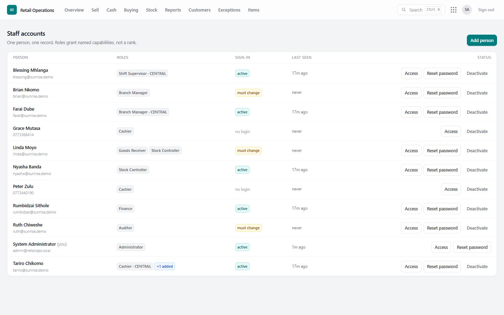
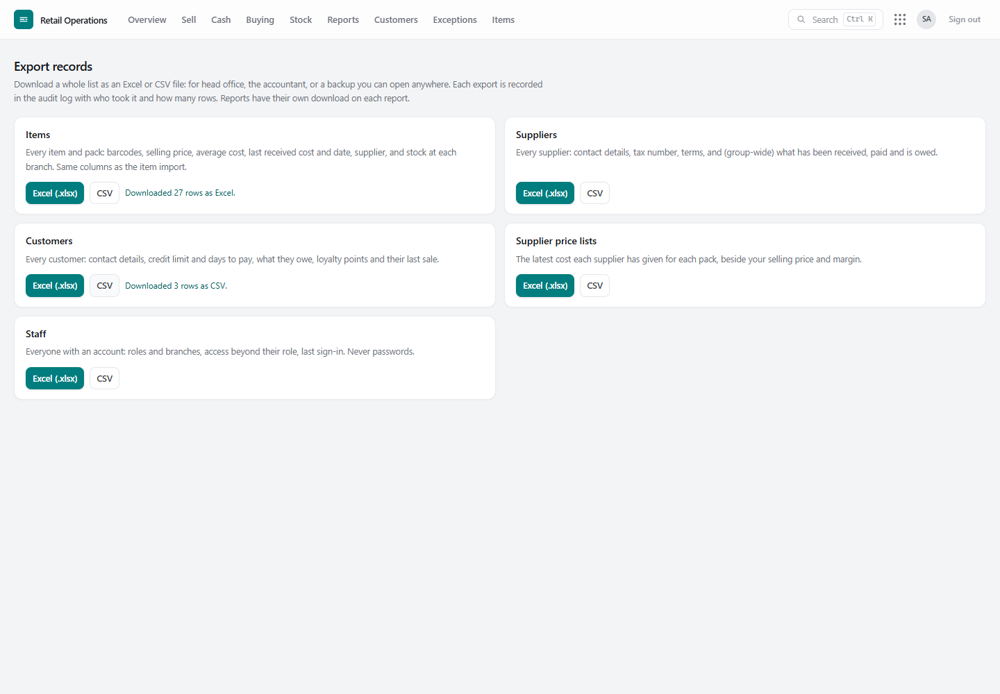
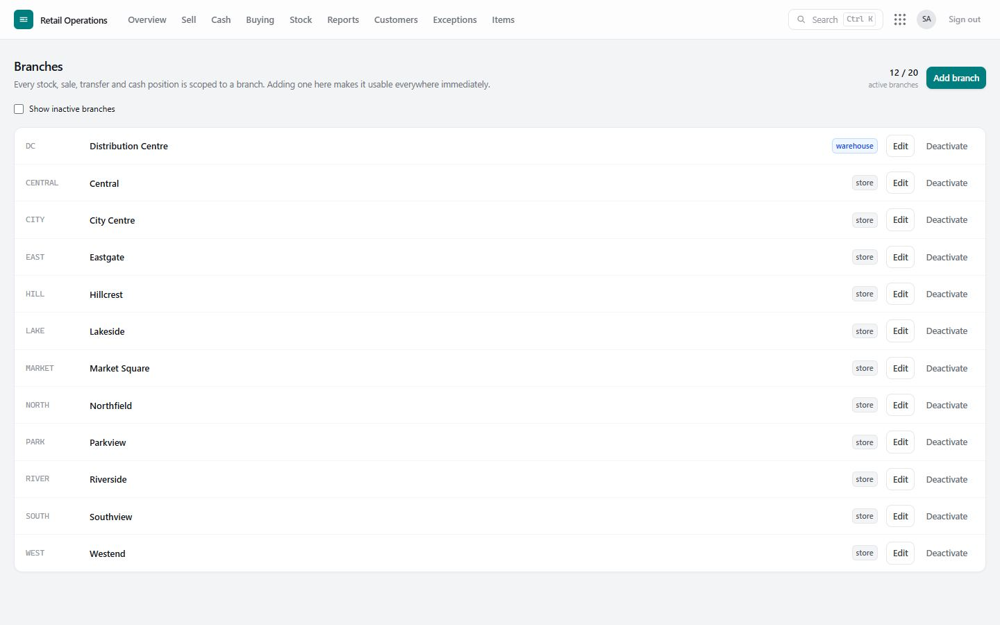
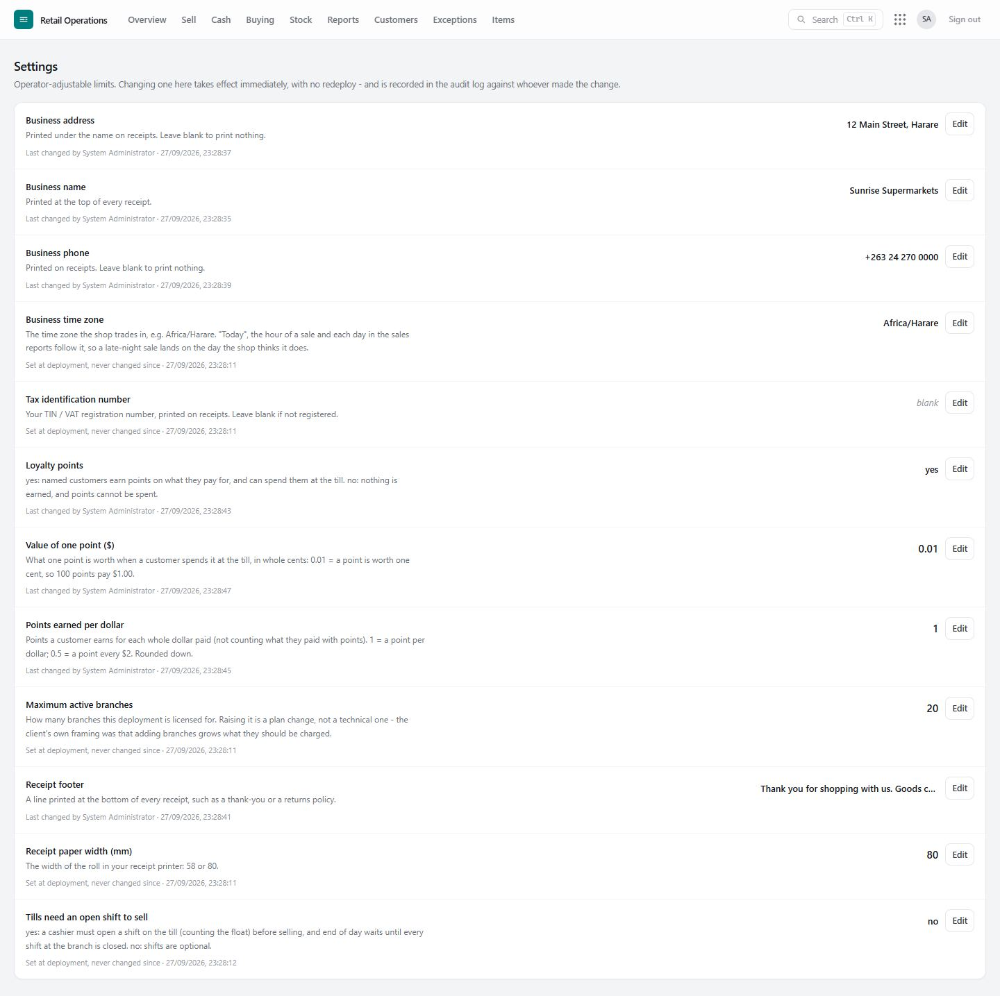

# 10. Administration

## Staff

**Staff** lists every person with their roles, branch, whether they have signed in, and any personal access (**+ added / − removed**).

| To… | Do this |
|---|---|
| Add a person | **Add person**: name, email (their sign-in), role, branch (or group-wide). A temporary password is shown **once** — pass it on; they choose their own at first sign-in. |
| See or change what they can do | **Access** — see [Roles and access](03-roles-and-access.md#access-for-one-person). |
| They forgot their password | **Reset password** — a new temporary password, shown once; their open sessions end. |
| Someone leaves | **Deactivate** — they are signed out everywhere at once. Nothing is deleted: their name stays on everything they did. **Reactivate** if they return. |

One person, one account. Shared logins make every record meaningless.

## Exporting records

**Administration › Export records** downloads a whole list as an **Excel** or **CSV** file: for head office, the accountant, or a copy you can open anywhere. Each record screen (Item master, Suppliers, Customers, Supplier price lists, Staff) also has an **Export** button with the same choice.

| Export | What is in it |
|---|---|
| **Items** | One row per pack: SKU, name, category, unit, pack, barcodes, **selling price**, **cost price** (the average cost of one pack, which is what stock is valued at), **margin**, **last received cost** with the **date** and **supplier** of the latest delivery, and **stock at each branch**. The first columns are the item import's, so a file can be edited and imported again. |
| **Suppliers** | Contact details, tax number, terms, days to pay; for group-wide users also goods received, returned, paid and **balance owed**. |
| **Customers** | Contact details, credit limit and days to pay, **balance owed**, loyalty points, last sale. Same headings as the customer import. |
| **Supplier price lists** | The latest cost each supplier gave for each pack, beside your selling price and margin. |
| **Staff** | Name, sign-in email, roles and branches, access beyond or short of their role, last sign-in. Never passwords. Administrators only. |

**Who may export:** anyone with *Export records* (administrators and branch managers; give it to, or take it from, anyone on their **Access** page) — and only data they may already see. A branch manager's item export shows their own branch's stock and costs, and their supplier export leaves out what is owed (group-wide finance).

**Every export is in the audit log** (*Exported records*: who, what, how many rows). A text cell that a spreadsheet would treat as a formula (starting with `=`, `+`, `-` or `@`) is written as plain text, so a file from the system is always safe to open.

Reports have their own **Export CSV** on the report itself: Stock on hand, Sales receipts, Sales and profit, Item analysis, Stock movement, the stock ledger, statements, debtors and creditors.

## Branches

**Branches** — add a branch (code, name, **store** or **warehouse**), rename it, or close it. The number of active branches follows the business's plan (**Settings**).

## Settings

**Settings** (administrators, and anyone given *Change system settings*). Each setting says what it does; changes are audited.

| Setting | What it does |
|---|---|
| **Business name, address, phone, tax number** | Printed on receipts. |
| **Receipt footer** | A line at the bottom of every receipt (thank you, returns policy). |
| **Receipt paper width** | 58 mm or 80 mm. |
| **Business time zone** | What "today" means for reports and the day's close (e.g. Africa/Harare). |
| **Tills need an open shift to sell** | yes / no — see [Shifts](05-cash-and-end-of-day.md#cashier-shifts). |
| **Loyalty points** | yes / no, **points per dollar**, **value of one point** — see [Loyalty](08-customers-and-loyalty.md#loyalty-points). |
| **Maximum active branches** | The plan's branch limit. |
