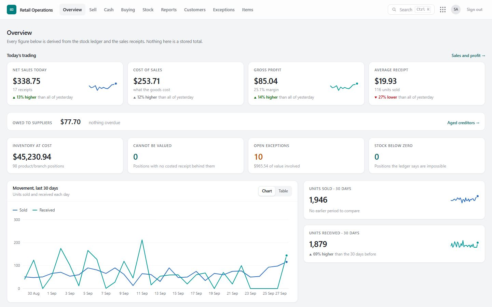

# Retail Operations Platform — User & Partner Guide

> One system for every branch: the tills, the stock, the suppliers, the cash, the customers and the numbers — with every movement recorded, nothing deleted, and anything unusual put in front of a named person.

**Live system:** [retail-five-pi.vercel.app](https://retail-five-pi.vercel.app) · **This guide in the system:** [/docs](https://retail-five-pi.vercel.app/docs)



---

## Who this guide is for

| You are… | Start here |
|---|---|
| **New to the platform** and want the big picture | [1. What the platform is](01-introduction.md) |
| **Setting it up** for a business, or signing in for the first time | [2. Getting started](02-getting-started.md) |
| **An owner or administrator** deciding who can do what | [3. Roles and access](03-roles-and-access.md) |
| **A cashier or supervisor** | [4. Selling at the till](04-selling.md) · [5. Shifts, cash and end of day](05-cash-and-end-of-day.md) |
| **A stock controller or branch manager** | [6. Items, prices and stock](06-items-prices-stock.md) · [7. Buying from suppliers](07-buying.md) |
| **Finance or an auditor** | [8. Customers, credit and loyalty](08-customers-and-loyalty.md) · [9. Reports and controls](09-reports-and-controls.md) |
| **Running the system** | [10. Administration](10-administration.md) |
| **Selling the platform** to a new client | [11. The demo guide](11-demo-guide.md) |
| **An engineer or integration partner** | [12. API reference](12-api-reference.md) · [13. How it is built](13-how-it-is-built.md) |
| **Stuck** | [14. Questions and answers](14-faq.md) |

## The platform on one page

```
                         ┌──────────────── Group overview ─────────────────┐
                         │  sales · profit · stock value · exceptions      │
                         └─────────────────────────────────────────────────┘
   SELL                 STOCK                  BUY                   MONEY
   ─────                ─────                  ───                   ─────
   Tills & receipts     Item master & prices   Suppliers             Cash custody (tills, safes)
   Shifts (float in,    Stock on hand          Purchase orders       Shifts & end of day (X / Z)
     blind count out)   Stock ledger           Goods received        Customer accounts & debtors
   Customers & points   Stock take             Returns to supplier   Supplier payments & creditors
   Payments: cash,      Opening stock          Supplier price lists  Sales, cost & profit reports
     mobile, card,      Transfers between
     account, points      branches
                         ┌──────────────── Controls ───────────────────────┐
                         │ Exception queue · audit log · roles & access    │
                         └─────────────────────────────────────────────────┘
```

## Five ideas that explain everything

1. **Every movement is a record.** A sale, a delivery, a count, a transfer, a cash drop: each one is written down as it happens and is never edited or deleted. Mistakes are corrected with a new, visible entry — the way an accountant would.
2. **Balances are worked out, not typed in.** Stock on hand, cash in a till, what a customer owes, a supplier's balance, a customer's points: all are the sum of their records. They cannot drift, and they can always be explained line by line.
3. **Anything unusual goes to a person.** Selling below zero, a price changed at the till, a till short at the end of a shift, a credit limit raised, access given beyond a role — each lands in the **exception queue** with who, when and how much, until someone clears it.
4. **People get the access their job needs.** Roles give the usual set; an administrator can add or remove single permissions for one person. Branch staff see their own branch only.
5. **It works where the work is.** On a till, a laptop, a tablet or a phone, in the browser. Receipts print on 58 mm or 80 mm roll printers.

## About this guide

- Screenshots come from a **demonstration business ("Sunrise Supermarkets")** with invented branches, staff, suppliers and customers. Your screens show your own data.
- Words in **bold** are the names of buttons, tabs or screens as they appear in the system.
- The guide is kept in the code repository (`docs/guide/`) and published inside the system at **/docs**, so both always match the version that is running.
